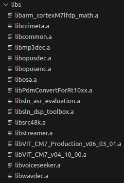

# CHIP RT1060 All-clusters Application

The all-clusters example implements a server which can be accesed by a CHIP
controller and can accept basic cluster commands.

The example is based on
[Project CHIP](https://github.com/project-chip/connectedhomeip) and the NXP
RT1060 SDK, and provides a prototype application that demonstrates device
commissioning and different cluster control.

<hr>

- [CHIP RT1060 All-clusters Application](#chip-rt1060-all-clusters-application)
  - [Introduction](#introduction)
    - [Configurations supported](#configurations-supported)
    - [Hardware requirements RT1060 + transceiver](#hardware-requirements-rt1060--transceiver)
      - [Hardware requirements RT1060+IW416](#hardware-requirements-rt1060iw416)
      - [Hardware requirements RT1060+8801](#hardware-requirements-rt10608801)
      - [Hardware requirements RT1060 + K32W0](#hardware-requirements-rt1060--k32w0)
      - [Hardware requirements RT1060-EVKC+IW612](#hardware-requirements-rt1060-evkciw612)
      - [Hardware requirements RT1060 + 88W8801 + K32W0x1DK6](#hardware-requirements-rt1060--88w8801--k32w0x1dk6)
  - [Building](#building)
    - [Building with Matter over Wifi configuratiom on RT1060 + transceiver](#building-with-matter-over-wifi-configuratiom-on-rt1060--transceiver)
    - [Build with Matter over Thread configuration on RT1060 + transceiver](#build-with-matter-over-thread-configuration-on-rt1060--transceiver)
      - [Build with Matter over Thread configuration on RT1060 + K32W0](#build-with-matter-over-thread-configuration-on-rt1060--k32w0)
      - [Build with Matter over Thread configuration on RT1060-EVKC + IW612](#build-with-matter-over-thread-configuration-on-rt1060-evkc--iw612)
    - [Build with Matter over Wi-Fi + OpenThread Border Router configuration on RT1060 + 88W8801 + K32W0x1DK6](#build-with-matter-over-wi-fi--openthread-border-router-configuration-on-rt1060--88w8801--k32w0x1dk6)
    - [General Information](#general-information)
  - [Manufacturing data](#manufacturing-data)
  - [Flashing and debugging](#flashing-and-debugging)
  - [Testing the example](#testing-the-example)
      - [Matter over wifi configuration :](#matter-over-wifi-configuration-)
      - [Matter over thread configuration :](#matter-over-thread-configuration-)
      - [Matter over wifi with openthread border router configuration :](#matter-over-wifi-with-openthread-border-router-configuration-)
    - [Testing the all-clusters application without Matter CLI:](#testing-the-all-clusters-application-without-matter-cli)
    - [Testing the all-clusters application with Matter CLI enabled:](#testing-the-all-clusters-application-with-matter-cli-enabled)
    - [Testing the all-clusters application with SV integration:](#testing-the-all-clusters-application-with-sv-integration)
    - [Customization of the all-clusters application with SV integration:](#customization-of-the-all-clusters-application-with-sv-integration)

<hr>

<a name="intro"></a>

## Introduction


The RT1060 all-cluster application provides a working demonstration of the
RT1060 board integration, built using the Project CHIP codebase and the NXP
RT1060 SDK.

The example supports:

-   Matter over Wi-Fi
-   Matter over Openthread
-   Matter over Wi-Fi with Openthread Border Router support

The example targets the
[NXP MIMXRT1060-EVKB](https://www.nxp.com/design/development-boards/i-mx-evaluation-and-development-boards/mimxrt1060-evk-i-mx-rt1060-evaluation-kit:MIMXRT1060-EVK)
board by default. It is also possible to use the older EVK-MIMXRT1060 board,
build and board setup instructions differ in some steps.

### Configurations supported

Here are listed configurations supported on RT1060.

Matter over Wi-Fi :

-   RT1060 + IW416 (Wi-Fi + BLE)
-   RT1060 + 8801 (Wi-Fi)
-   **Experimental:** _RT1060-EVKC + IW612 (Wi-fi +BLE)_

Matter over Thread :

-   RT1060 + K32W0 (15.4 + BLE)
-   **Experimental:** _RT1060-EVKC + IW612 (15.4 + BLE)_

Matter over Wi-Fi with Openthread Border Router support :

-   RT1060 + 88W8801 + K32W0x1DK6

### Hardware requirements RT1060 + transceiver

#### Hardware requirements RT1060+IW416

Host part:

-   1 MIMXRT1060-EVKB or EVK-MIMXRT1060 board
-   external 5V supply

Transceiver part:

-   1 AzureWave AW-AM510-uSD evaluation board

Jumper settings for MIMXRT1060-EVKB (enables external 5V supply):

-   remove J40 5-6
-   connect J40 1-2
-   connect J45 with external power (controlled by SW6 - position 3)

Jumper settings for EVK-MIMXRT1060 (enables external 5V supply):

-   remove J1 5-6
-   connect J1 1-2
-   connect J2 with external power (enabled by SW1 - position 3)

The hardware should be reworked according to the chapter _Hardware Rework Guide
for MIMXRT1060-EVKB and AW-AM510-uSD_ or the chapter _Hardware Rework Guide for
MIMXRT1060-EVK and AW-AM510-uSD_ in the document _Hardware Rework Guide for
EdgeFast BT PAL_ which can be found in the NXP RT1060 SDK
(docs/wireless/Bluetooth/Edgefast_bluetooth/Hardware Rework Guide for EdgeFast
BT PAL.pdf):

-   Make sure resistors R368/R376/R347/R349/R365/R363/R193/R186 are removed.

Only the SDK package downloaded from https://mcuxpresso.nxp.com contains the PDF
document mentioned above, it is not present in the SDK downloaded from GitHub
using the west tool.

Jumper settings for AzureWave AW-AM510-uSD Module:

-   J4 1-2: VIO 1.8V (Voltage level of SDIO pins is 1.8V)
-   J2 1-2: 3.3V VIO_uSD (Power Supply from uSD connector)
-   The pin 1 of J4 is not marked on the board. Please note that pin numbering
    of J4 is opposite to J2.

Plug AW-AM510-uSD into uSD connector J22 on MIMXRT1060-EVKB or J39 on
EVK-MIMXRT1060.

Connect the following pins between RT1060 and AW-AM510-uSD to enable Bluetooth
HCI UART:

| PIN NAME | AW-AM510-USD | MIMXRT1060-EVKB | EVK-MIMXRT1060 | PIN NAME OF RT1060 | GPIO NAME OF RT1060 |
| -------- | ------------ | --------------- | -------------- | ------------------ | ------------------- |
| UART_TXD | J10 (pin 4)  | J16 (pin 1)     | J22 (pin 1)    | LPUART3_RXD        | GPIO_AD_B1_07       |
| UART_RXD | J10 (pin 2)  | J16 (pin 2)     | J22 (pin 2)    | LPUART3_TXD        | GPIO_AD_B1_06       |
| UART_RTS | J10 (pin 6)  | J33 (pin 3)     | J23 (pin 3)    | LPUART3_CTS        | GPIO_AD_B1_04       |
| UART_CTS | J10 (pin 8\) | J33 (pin 4)     | J23 (pin 4)    | LPUART3_RTS        | GPIO_AD_B1_05       |
| GND      | J6 (pin 7)   | J32 (pin 7)     | J25 (pin 7)    | GND                | GND                 |

Attach external antenna into connector on AW-AM510-uSD.

Additional information about the AW-AM510-uSD can be found in the user manual
_UM11441 - Getting Started with NXP-based Wireless Modules and i.MX RT Platform
Running RTOS_, which can be found in the NXP RT1060 SDK
(docs/wireless/UM11441-Getting-Started-with-NXP-based-Wireless-Modules-and-i.MX-RT-Platform-Running-on-RTOS.pdf).
Only the SDK package downloaded from https://mcuxpresso.nxp.com contains the PDF
document, it is not present in the SDK downloaded from GitHub using the west
tool.

#### Hardware requirements RT1060+8801

Host part:

-   1 MIMXRT1060-EVKB

Transceiver part :

-   1 8801 2DS M.2 Module (rev A)
-   1 Murata uSD-M.2 Adapter (rev B1)

The 8801 2DS M.2 Module should be inserted into the Murata uSD-M.2 Adapter and
inserted in the uSD slot J22 of MIMXRT1060-EVKB. The Murata uSD-M.2 Adapter can
be powered up using uSD pins. For that, set the J1 jumper of Murata uSD-M.2 to
position 2-3 (Position 2-3: VBAT supply, typical 3.1 ~ 3.3V, from microSD
connector).

Note: as the 8801 module supports only the 2.4 GHz Wi-Fi band, it is mandatory
to connect it to a Wi-Fi access point on the 2.4 GHz band.

#### Hardware requirements RT1060 + K32W0

Host part:

-   1 MIMXRT1060-EVKB or EVK-MIMXRT1060 board

Transceiver part:

-   1 OM15076-3 Carrier Board (DK6 board)
-   1 K32W0 Module to be plugged on the Carrier Board

**Board settings**

The below table explains pin settings (UART settings) to connect the
evkbmimxrt1060 (host) to a k32w061 transceiver (rcp).

|    PIN NAME    | DK6 (K32W061) | I.MXRT1060-EVKB | I.MXRT1060-EVK | PIN NAME OF RT1060 | GPIO NAME OF RT1060 |
| :------------: | :-----------: | :-------------: | :------------: | :----------------: | :-----------------: |
|    UART_TXD    |  PIO, pin 8   |   J16, pin 1    |   J22, pin 1   |    LPUART3_RXD     |    GPIO_AD_B1_07    |
|    UART_RXD    |  PIO, pin 9   |   J16, pin 2    |   J22, pin 2   |    LPUART3_TXD     |    GPIO_AD_B1_06    |
|    UART_RTS    |  PIO, pin 6   |   J33, pin 3    |   J23, pin 3   |    LPUART3_CTS     |    GPIO_AD_B1_04    |
|    UART_CTS    |  PIO, pin 7   |   J33, pin 4    |   J23, pin 4   |    LPUART3_RTS     |    GPIO_AD_B1_05    |
|      GND       |   J3, pin 1   |   J32, pin 7    |   J25, pin 7   |         XX         |         XX          |
|     RESET      |     RSTN      |   J33, pin 2    |   J23, pin 2   |   GPIO_AD_B1_11    |    GPIO_AD_B1_11    |
| DIO5/ISP Entry |  PIO, pin 5   |   J33, pin 1    |   J23, pin 1   |   GPIO_AD_B1_10    |    GPIO_AD_B1_10    |

The below picture shows pins connections for the EVK-MIMXRT1060.


#### Hardware requirements RT1060-EVKC+IW612

Host part:

-   1 MIMXRT1060-EVKC

    Hardware should be reworked as below:

    -   populate R93, R96, R2155, R2156, R2157, R2158, R2159 with 0Ohm resistors
    -   J76 and J107 jumpers in 2-3 position.
    -   J109 and J110 jumpers in 1-2 position.
    -   disconnect pin15 of component U9


Transceiver part :

-   1 IW612 ( Firecrest) 2EL M.2 Module (rev A1)

The IW612 module should be plugged to the M.2 connector on RT1060-EVKC board.

#### Hardware requirements RT1060 + 88W8801 + K32W0x1DK6

-   i.MX RT1060 EVKA or EVKB board
-   88W8801 module (for Wi-Fi connection), for example 88W8801 2DS M.2 Module
    (rev A) and Murata uSD-M.2 Adapter (rev B1)
-   K32W0x1 mezzanine module (for Thread connection)
-   IOTZTB-DK006 carrier board for the K32W0x1 module (referenced as DK6 carrier
    board)

<a name="building"></a>

## Building

In order to build the Project CHIP example, we recommend using a Linux
distribution (the demo-application was compiled on Ubuntu 20.04).

-   Follow instruction in [BUILDING.md](../../../../../docs/guides/BUILDING.md)
    to setup the environement to be able to build Matter

-   Download the NXP MCUXpresso git SDK and associated middleware from GitHub
    using the west tool.

```
user@ubuntu:~/Desktop/git/connectedhomeip$ scripts/checkout_submodules.py --shallow --platform nxp --recursive
user@ubuntu:~/Desktop/git/connectedhomeip$ source ./scripts/bootstrap.sh
user@ubuntu:~/Desktop/git/connectedhomeip$ source ./scripts/activate.sh
user@ubuntu:~/Desktop/git/connectedhomeip$ cd third_party/nxp/github_sdk/rt
user@ubuntu:~/Desktop/git/connectedhomeip/third_party/nxp/github_sdk/rt$ west init -l manifest --mf west.yml
user@ubuntu:~/Desktop/git/connectedhomeip/third_party/nxp/github_sdk/rt$ west update
```

Troubleshoot in case of errors with lwip:
```
cd repo/sdk-2.15/middleware/lwip/
git fetch
git checkout release/2.15.100_minor_rfp
```
The update command will still throw an error for lwip, but it can be safely ignored as the repository was manually checked out to the correct commit.

-   In case there are local modification to the already installed git NXP SDK.
    Use the west forall command instead of the west init to reset the west
    workspace before running the west update command. Warning: all local changes
    will be lost after running this command.

```
user@ubuntu:~/Desktop/git/connectedhomeip/third_party/nxp/rt_sdk/repo$ west forall -c "git reset --hard && git clean -xdf" -a
```

At this point, the machine is ready to build examples. When it is needed to build the project again, only the steps below should be executed.

-   Start building the application.

# Download project libraries
​
All libraries used in the SVUI project can be found in a zip file under the name **sln_svui_iot_libs.zip** on the solution page on [nxp.com](https://www.nxp.com/mcu-svui). After downloading, unzip the libraries and add them to the project, in the **sln_svui_iot_matter/examples/platform/nxp/rt/rt1060/app/libs** folder.
​

After adding the files, the content for the **sln_svui_iot_matter/examples/platform/nxp/rt/rt1060/app/libs** should look as in the image below:

​
 <br/><br/>
​
# DSMT production and evaluation libraries

> [!NOTE]
> For DSMT integration, there are 2 libraries included: the production lib_sln_asr and the evaluation lib_sln_asr.
>
> The sln_asr_production lib is found in the **sln_svui_iot_libs.zip** file together with the rest of the libraries.
>
> The sln_asr_evaluation lib needs to be downloaded separately from the solution page on [nxp.com](https://www.nxp.com/mcu-svui).
>
> The production library works only on RT106C.
>
> The dev kit is based on RT106V.
>
> In order to have the DSMT project working on RT106V, one must use the evaluation lib_sln_asr.
>
> The lib must be used for evaluation only and not for going into production as this will break the redistribution terms.

In order to link with the production lib_sln_asr, one must:
1. Copy libsln_asr_production.a in sln_svui_iot_matter/examples/platform/nxp/rt/rt1060/app/libs folder.
2. Select DSMT ASR in app.h
3. In rt_sdk.gni, uncomment line 442 and comment line 441
4. Continue building as per the next instructions in the README.

When using the libsln_asr_production.a, for going into production with RT106C, please do not forget to set USE_DSMT_EVALUATION_MODE to 0 in app.h.

In order to link with the evaluation lib_sln_asr, one must:
1. Copy libsln_asr_evaluation.a in sln_svui_iot_matter/examples/platform/nxp/rt/rt1060/app/libs folder.
2. Select DSMT ASR in app.h
3. In rt_sdk.gni, uncomment line 441 and comment line 442
4. Continue building as per the next instructions in the README.

# VIT speech-to-intent and commands libraries

> [!NOTE]
> VIT offers two types of voice detection engines: one of them used for detecting only predefined commands and the other one 
> being able to detect intents thus offering a lot more flexibilty.

The following VIT libraries are found in the **sln_svui_iot_libs.zip** file on the solution page [nxp.com](https://www.nxp.com/mcu-svui):
- The Matter example uses VIT_CM7_Production_v06_03_01 for S2I and VIT_CM7_v04_10_00 for VIT

Depending on the desired demo and engine combination, the user needs to download the specific library from the solution page and then follow the steps below.

In order to link the speech-to-intent VIT library, one must:
1. Copy VIT_CM7_Production_v06_03_01.a in sln_svui_iot_matter/examples/platform/nxp/rt/rt1060/app/libs folder.
2. In rt_sdk.gni, uncomment line 446 and comment line 447
4. Select S2I ASR in app.h and build the project.

In order to link the commands VIT library, one must:
1. Copy VIT_CM7_v04_10_00.a in sln_svui_iot_matter/examples/platform/nxp/rt/rt1060/app/libs folder.
2. In rt_sdk.gni, uncomment line 447 and comment line 446
3. Select VIT ASR in app.h and build the project.

### Building with Matter over Wifi configuration on i.MX RT106V SLN-SVUI-IOT

```
cd ~/sln_svui_iot_matter/third_party/nxp/rt_sdk/svui_sdk_fixes
./patch_rt_1060_sdk.sh
```
When running this a second time, it will say that the patches were already applied, this is expected. When sdk changes are made, this needs to be run on a clean sdk. To clean the sdk:
```
cd ~/sln_svui_iot_matter/third_party/nxp/github_sdk/rt/repo/sdk-2.15
west forall -c "git reset --hard" -a
```

```
cd ~/sln_svui_iot_matter
source scripts/activate.sh
cd examples/all-clusters-app/nxp/rt/rt1060
gn gen out/debug
ninja -C out/debug
```

The final binary will be found in folder `out/debug`.

### Building with Matter over Wifi configuration on RT1060 + transceiver

-   Build the Wi-fi configuration for **MIMXRT1060-EVKB board + IW416
    transceiver** (with BLE for commissioning).

```
user@ubuntu:~/Desktop/git/connectedhomeip/examples/all-clusters-app/nxp/rt/rt1060$ gn gen --args="chip_enable_wifi=true iw416_transceiver=true" out/debug
user@ubuntu:~/Desktop/git/connectedhomeip/examples/all-clusters-app/nxp/rt/rt1060$ ninja -C out/debug
```

-   Build the Wi-fi configuration for **EVKB-MIMXRT1060 board + 8801
    transceiver** with Matter-over-Wifi configuration and only onnetwork
    commissioning (without BLE, the WiFi network credentials are provided at
    build-time which will enable the device to join the Wi-Fi AP at startup):

```
user@ubuntu:~/Desktop/git/connectedhomeip/examples/all-clusters-app/nxp/rt/rt1060$ gn gen --args="chip_enable_wifi=true w8801_transceiver=true chip_config_network_layer_ble=false tcp_download=true wifi_ssid=\"your_wifi_ssid\" wifi_password=\"your_wifi_password\"" out/debug
user@ubuntu:~/Desktop/git/connectedhomeip/examples/all-clusters-app/nxp/rt/rt1060$ ninja -C out/debug
```

-   Build the Wi-fi configuration for **MIMXRT1060-EVKC board + IW612
    transceiver** (with BLE for commissioning).

```
user@ubuntu:~/Desktop/git/connectedhomeip/examples/all-clusters-app/nxp/rt/rt1060$ gn gen --args="chip_enable_wifi=true iwx12_transceiver=true evkname=\"evkcmimxrt1060\" " out/debug
user@ubuntu:~/Desktop/git/connectedhomeip/examples/all-clusters-app/nxp/rt/rt1060$ ninja -C out/debug
```

-   Build the Wi-fi configuration for **MIMXRT1060-EVKC board + IW612
    transceiver** with Matter-over-Wifi configuration and only onnetwork
    commissioning (without BLE, the WiFi network credentials are provided at
    build-time which will enable the device to join the Wi-Fi AP at startup):

```
user@ubuntu:~/Desktop/git/connectedhomeip/examples/all-clusters-app/nxp/rt/rt1060$ gn gen --args="chip_enable_wifi=true iwx12_transceiver=true evkname=\"evkcmimxrt1060\" chip_config_network_layer_ble=false tcp_download=true wifi_ssid=\"your_wifi_ssid\" wifi_password=\"your_wifi_password\"" out/debug
user@ubuntu:~/Desktop/git/connectedhomeip/examples/all-clusters-app/nxp/rt/rt1060$ ninja -C out/debug
```

### Build with Matter over Thread configuration on RT1060 + transceiver

#### Build with Matter over Thread configuration on RT1060 + K32W0

For this configuration a K32W0 RCP image is required and must support in a
single image the openthread RCP configuration and the BLE HCI BB configuration.
Messages between the host and the K32W0 transceiver are transfered on a single
UART with flow control support. For that the HDLC-Lite framing protocol is used
to transfert spinel and hci frames. In addition, hci and spinel frames can be
distinguished by using the Spinel convention which is line compatible with
BT/BLE HCI.

Before building the Matter host application, it is required to generate the
K32W0 image supporting features as described above. To build this binary the
target `ot_rcp_ble_hci_bb_single_uart_fc` should be built by following the
[Readme.md][ot_rcp_ble_hci_bb_k32w0_readme]. After a successfull build, a `".h"`
file will be generated and would contain the K32W0 RCP binary. As described in
the [Readme.md][ot_rcp_ble_hci_bb_k32w0_readme], the application binaries will
be generated in
`ot_nxp/build_k32w061/ot_rcp_ble_hci_bb_single_uart_fc/bin/ot-rcp-ble-hci-bb-k32w061.elf.bin.h`.

The generate K32W0 transceiver binary `".h"` file path must be indicated to the
host Matter application build. In fact the Matter host application is in charge
of storing the K32W0 firmware in its flash to be able to use the
`The Over The Wire (OTW) protocol (over UART)` to download (at host startup) the
k32w0 transceiver image from the host to the K32W0 internal flash. For more
information on the k32w0 OTW protocol, user can consult the doxygen header of
the file located in
`<repo_root>/third_party/nxp/rt_sdk/repo/middleware/wireless/framework/OTW/k32w0_transceiver/fwk_otw.c`.

Here is a summary of the k32w0 _gn gen_ arguments that are mandatory or
optional:

-   Mandatory: `k32w0_transceiver=true`
-   Mandatory: `hci_spinel_single_uart=true`
-   Optional:
    `k32w0_transceiver_bin_path=\"/home/ot-nxp/build_k32w061/ot_rcp_ble_hci_bb_single_uart_fc/bin/ot-rcp-ble-hci-bb-k32w061.elf.bin.h\"`
    This argument is optional, by default, if not set, the binary file located
    in
    "${chip_root}/third_party/openthread/ot_nxp/build_k32w061/ot_rcp_ble_hci_bb_single_uart_fc/bin/ot-rcp-ble-hci-bb-k32w061.elf.bin.h"
    will be used. If the K32W061 transceiver binary is saved at another location
    an absolute path of its location should be given.
-   Optional: `otw_logs_enabled=true` This argument is optional, by default
    being set to false. If set to true, RT logging will print the OTW logs.

[ot_rcp_ble_hci_bb_k32w0_readme]:
    https://github.com/NXP/ot-nxp/blob/v1.0.0.2-tag-nxp/examples/hybrid/ot_rcp_ble_hci_bb/k32w061/README.md#building-the-examples

Below is presented an example of _gn gen_ argument that could be used to
generate the host matter application with a k32w0 transceiver.

```
user@ubuntu:~/Desktop/git/connectedhomeip/examples/all-clusters-app/nxp/rt/rt1060$ gn gen --args="chip_enable_openthread=true k32w0_transceiver=true k32w0_transceiver_bin_path=\"/home/ot-nxp/build_k32w061/ot_rcp_ble_hci_bb_single_uart_fc/bin/ot-rcp-ble-hci-bb-k32w061.elf.bin.h\" hci_spinel_single_uart=true chip_inet_config_enable_ipv4=false chip_config_network_layer_ble=true" out/debug
user@ubuntu:~/Desktop/git/connectedhomeip/examples/all-clusters-app/nxp/rt/rt1060$ ninja -C out/debug
```

#### Build with Matter over Thread configuration on RT1060-EVKC + IW612

Build the OpenThread configuration for MIMXRT1060-EVKC board + IW612 transceiver
(with BLE for commissioning).

```
user@ubuntu:~/Desktop/git/connectedhomeip/examples/all-clusters-app/nxp/rt/rt1060$ gn gen --args="chip_enable_openthread=true  iwx12_transceiver=true evkname=\"evkcmimxrt1060\" chip_inet_config_enable_ipv4=false chip_config_network_layer_ble=true" " out/debug
user@ubuntu:~/Desktop/git/connectedhomeip/examples/all-clusters-app/nxp/rt/rt1060$ ninja -C out/debug
```

### Build with Matter over Wi-Fi + OpenThread Border Router configuration on RT1060 + 88W8801 + K32W0x1DK6

This configuration requires enabling the Matter CLI in order to control the
Thread network on the Border Router.

-   Build Matter with Border Router configuration with ble-wifi commissioning:

```
user@ubuntu:~/Desktop/git/connectedhomeip/examples/all-clusters-app/nxp/rt/rt1060$ gn gen --args="chip_enable_wifi=true w8801_transceiver=true chip_enable_matter_cli=true chip_config_network_layer_ble=true chip_enable_openthread=true k32w0_transceiver=true k32w0_transceiver_bin_path=\"/path/to/ot-rcp/ot-rcp-ble-hci-bb-k32w061.elf.bin.h\" hci_spinel_single_uart=true openthread_root =\"//third_party/connectedhomeip/third_party/openthread/ot-nxp/openthread-br\"" out/debug
user@ubuntu:~/Desktop/git/connectedhomeip/examples/all-clusters-app/nxp/rt/rt1060$ ninja -C out/debug
```

### General Information

The resulting output file can be found in
out/debug/chip-rt1060-all-cluster-example.

Optional GN options that can be added when building an application:

-   To enable the [matter CLI](README.md#matter-shell), the argument
    `chip_enable_matter_cli=true` must be added to the _gn gen_ command.
-   To build the application in debug mode, the argument
    `is_debug=true optimize_debug=false` must be added to the _gn gen_ command.
-   By default, the MIMXRT1060-EVKB will be chosen. To switch to an
    MIMXRT1060-EVK, the argument `evkname=\"evkmimxrt1060\"` must be added to
    the _gn gen_ command.
-   To build with the option to have Matter certificates/keys pre-loaded in a
    specific flash area the argument `chip_with_factory_data=1` must be added to
    the _gn gen_ command. (for more information see
    [Guide for writing manufacturing data on NXP devices](../../../../platform/nxp/doc/manufacturing_flow.md).

<a name="manufacturing"></a>

## Manufacturing data

See
[Guide for writing manufacturing data on NXP devices](../../../../platform/nxp/doc/manufacturing_flow.md)

Other comments:

The RT1060 all cluster app demonstrates the usage of encrypted Matter
manufacturing data storage. Matter manufacturing data should be encrypted before
flashing them to the RT1060 flash.

For development purpose the RT1060 all cluster app code could use the hardcoded
AES 128 software key. This software key should be used only during development
stage.

For production usage, it is recommended to use the OTP key which needs to be
fused in the RT1060 SW_GP2. The application note AN12800 should be followed to
get more information. In this case the all cluster app should be updated to
indicate to the DCP module to use the OTP key instead of the software key. For
that the call to "FactoryDataPrvdImpl().SetAes128Key()" should be changed to
"FactoryDataPrvdImpl().SetKeySelected(KeySelect::)" with the arg value
specifying where the OTP key is stored (kDCP_OCOTPKeyLow for [127:0] of SW_GP2
or kDCP_OCOTPKeyHigh for [255:128] of SW_GP2). For more information the RT1060
FactoryDataProviderImpl class description should be checked.

<a name="flashdebug"></a>

## Flashing and debugging

In order to flash the application we recommend using
[MCUXpresso IDE (version >= 11.6.0)](https://www.nxp.com/design/software/development-software/mcuxpresso-software-and-tools-/mcuxpresso-integrated-development-environment-ide:MCUXpresso-IDE).

-   Import the previously downloaded NXP SDK into MCUXpresso IDE.

Right click the empty space in the MCUXpresso IDE's "Installed SDKs" tab to show
the menu, select the "Import local SDK Git repository" menu item.


The "Import SDK Git" window will open. The "Repository location" text field
should point to the west workspace (third_party/nxp/rt_sdk/repo subfolder of the
Matter repository). The "Manifest(s) folder" text field should point to its core
subfolder (third_party/nxp/rt_sdk/repo/core subfolder of the Matter repository).
Click "OK" and wait for MCUXpresso IDE to import the SDK.


Finally select the desired board's SDK manifest in the "Installed SDKs" tab.


-   Import the connectedhomeip repo in MCUXpresso IDE as Makefile Project. Use
    _none_ as _Toolchain for Indexer Settings_:

```
File -> Import -> C/C++ -> Existing Code as Makefile Project
```

-   Configure MCU Settings:

```
Right click on the Project -> Properties -> C/C++ Build -> MCU Settings -> Select MIMXRT1060 -> Apply & Close
```


Sometimes when the MCU is selected it will not initialize all the memory regions
(usualy the BOARD_FLASH, BOARD_SDRAM and NCAHCE_REGION) so it is required that
this regions are added manualy like in the image above. In addition to that on
the BOARD_FLASH line, in the driver tab:

```
click inside the tab and on the right side a button with three horizontal dots will appear
click on the button and an window will show
form the dropdown menu select the MIMXRT1060_SFDP_QSPI driver
```


-   Configure the toolchain editor:

```
Right click on the Project -> C/C++ Build-> Tool Chain Editor -> NXP MCU Tools -> Apply & Close
```


-   Create a debug configuration:

```
Right click on the Project -> Debug -> As->MCUXpresso IDE LinkServer (inc. CMSIS-DAP) probes -> OK -> Select elf file
```


-   Set the _Connect script_ for the debug configuration to _RT1060_connect.scp_
    from the dropdown list:

```
Right click on the Project -> Debug As -> Debug configurations... -> LinkServer Debugger
```


-   Set the _Initialization Commands_ to:

```
Right click on the Project -> Debug As -> Debug configurations... -> Startup

set non-stop on
set pagination off
set mi-async
set remotetimeout 60000
##target_extended_remote##
set mem inaccessible-by-default ${mem.access}
mon ondisconnect ${ondisconnect}
set arm force-mode thumb
${load}
```


-   Set the _vector.catch_ value to _false_ inside the .launch file:

```
Right click on the Project -> Utilities -> Open Directory Browser here -> edit *.launch file:

<booleanAttribute key="vector.catch" value="false"/>

```

-   Debug using the newly created configuration file:

<a name="testing-the-example"></a>

## Testing the example

To know how to commision a device over BLE, follow the instructions from
[chip-tool's README.md 'Commission a device over
BLE'][readme_ble_commissioning_section].

[readme_ble_commissioning_section]:
    ../../../../chip-tool/README.md#commission-a-device-over-ble

To know how to commissioning a device over IP, follow the instructions from
[chip-tool's README.md 'Pair a device over
IP'][readme_pair_ip_commissioning_section]

[readme_pair_ip_commissioning_section]:
    ../../../../chip-tool/README.md#pair-a-device-over-ip

#### Matter over wifi configuration :

The "ble-wifi" pairing method can be used in order to commission the device.

#### Matter over thread configuration :

The "ble-thread" pairing method can be used in order to commission the device.

#### Matter over wifi with openthread border router configuration :

In order to create or join a Thread network on the Matter Border Router, the
`otcli` commands from the matter CLI can be used. For more information about
using the matter shell, follow instructions from
['Testing the all-clusters application with Matter CLI'](#testing-the-all-clusters-application-with-matter-cli-enabled).

In this configuration, the device can be commissioned over Wi-Fi with the
'ble-wifi' pairing method.

### Testing the all-clusters application without Matter CLI:

1. Prepare the board with the flashed `All-cluster application` (as shown
   above).
2. The All-cluster example uses UART1 to print logs while runing the server. To
   view raw UART output, start a terminal emulator like PuTTY and connect to the
   used COM port with the following UART settings:

    - Baud rate: 115200
    - 8 data bits
    - 1 stop bit
    - No parity
    - No flow control

3. Open a terminal connection on the board and watch the printed logs.

4. On the client side, start sending commands using the
   [chip-tool](../../../../../examples/chip-tool) application as it is described
   [here](../../../../../examples/chip-tool/README.md#using-the-client-to-send-matter-commands).

### Testing the all-clusters application with Matter CLI enabled:

The Matter CLI can be enabled with the all-clusters application.

For more information about the Matter CLI default commands, you can refer to the
dedicated [ReadMe](../../../../shell/README.md).

The All-clusters application supports additional commands :

```
> help
[...]
mattercommissioning     Open/close the commissioning window. Usage : mattercommissioning [on|off]
matterfactoryreset      Perform a factory reset on the device
matterreset             Reset the device
```

-   `matterfactoryreset` command erases the file system completely (all Matter
    settings are erased).
-   `matterreset` enables the device to reboot without erasing the settings.

Here are described steps to use the all-cluster-app with the Matter CLI enabled

1. Prepare the board with the flashed `All-cluster application` (as shown
   above).
2. The matter CLI is accessible in UART1. For that, start a terminal emulator
   like PuTTY and connect to the used COM port with the following UART settings:

    - Baud rate: 115200
    - 8 data bits
    - 1 stop bit
    - No parity
    - No flow control

3. The All-cluster example uses UART2 to print logs while runing the server. To
   view raw UART output, a pin should be plugged to an USB to UART adapter
   (connector J16 pin 7 in case of MIMXRT1060-EVKB board or connector J22 pin 7
   in case of EVK-MIMXRT1060 board), then start a terminal emulator like PuTTY
   and connect to the used COM port with the following UART settings:

    - Baud rate: 115200
    - 8 data bits
    - 1 stop bit
    - No parity
    - No flow control

4. On the client side, start sending commands using the
   [chip-tool](../../../../../examples/chip-tool/README.md) application as it is
   described
   [here](../../../../../examples/chip-tool/README.md#using-the-client-to-send-matter-commands).

For Matter with OpenThread Border Router support, the matter CLI can be used to
start/join the Thread network, using the following ot-cli commands. (Note that
setting channel, panid, and network key is not enough anymore because of an Open
Thread stack update. We first need to initialize a new dataset.)

```
> otcli dataset init new
Done
> otcli dataset
Active Timestamp: 1
Channel: 25
Channel Mask: 0x07fff800
Ext PAN ID: 42af793f623aab54
Mesh Local Prefix: fd6e:c358:7078:5a8d::/64
Network Key: f824658f79d8ca033fbb85ecc3ca91cc
Network Name: OpenThread-b870
PAN ID: 0xb870
PSKc: f438a194a5e968cc43cc4b3a6f560ca4
Security Policy: 672 onrc 0
Done
> otcli dataset panid 0xabcd
Done
> otcli dataset channel 25
Done
> otcli dataset commit active
Done
> otcli ifconfig up
Done
> otcli thread start
Done
> otcli state
leader
Done
```

### Testing the all-clusters application with SV integration:

The Smart Voice integrated Matter project has the role of demonstrating how to control multiple Matter nodes based on voice commands and binding. Each SV board will be binded to the rest from the Matter network and will be able to control them based on the location present in the voice command. Regarding the voice control, there are 3 voice engines supported: VIT, DSMT and S2I. 

The available commands for the VIT & DSMT:
- "Turn on the lights"
- "Turn off the lights"
- "Open the window"
- "Close the window"
- "Make it brighter"
- "Make it darker"

For the S2I there are the following functionalities:
- Turning on/off the LED
    - This is done using the OnOff cluster
- Changing the color of the LED
    - This is done using the ColorControl cluster
    - The available colors: blue, red, green, pink, orange, yellow, purple
- Changing the level of brightness of the LED
    - This is done using the LevelControl cluster
    - The brightness will be set to a certain level from 0 to 100
- Controlling shades through a PWM motor
    - The shades will lift/lower based on a certain percentage from 0 to 100
    
In the following we will be referring to 2 types of controllers:
- "Matter controller" => this is represented by the Matter controller on which the commissioning and binding take place, such as Raspberry Pi or i.MX 8M Mini
- "voice controller" => this is represented by a SVUI board, which will take the "leader" role in a certain moment

Each voice controller will have the following capabilities:
- Detecting the wake word & command
- Understanding what is the device that needs to be controlled based on the location present in the command
- Sending a Matter command to that specific device in order to invoke and take the corresponding action

Start with a controller. The Matter network will contain multiple SV boards that will be commissioned by the Matter controller. Each one of them should be able to have the role of the voice controller, as well as be controllable by the others. All of the boards will need to be "named" based on 4 different locations for the LED functionalities ("bedroom", "kitchen", "living room", "bathroom") and 1 location ("central") for the shades function. This is a very important step because this is how the current voice controller identifies to which board it should send commands to. After that, the user will say different voice commands (regarding the LED or the shades) to one of the SV boards. There are 3 possible situations:
1. The commands contain the location. Then, the voice controller sends the specific Matter command to the corresponding board. 
2. The commands contain the location of the current SV board that the user is talking to. In this case, the actions will take place locally, without the need to involve Matter communication.
3. A location is not present in the commands. This will be interpreted as a group command, involving all Matter nodes from the fabric. 
    
Some examples of voice commands:
- "Lights on"
- "Lights on in the bedroom"
- "Turn the lights off in the kitchen"
- "Blue lights in the bathroom"
- "Make living room light pink"
- "Orange lights"
- "Increase brightness by 10 percent in the bedroom"
- "Raise all shades"
- "Raise all the blinds partially"
All available expressions can be found at path: `sln_svui_iot_matter/examples/platform/nxp/rt/rt1060/app/local_voice/S2I/en/VIT_Model_en_Home_expressions.txt`.
 
For the shades functionality: the S2I intents don’t have a location set to them, they use "side" (left, right, middle, all). For our demo:
- The board that will represent the shades will be named "central"
- The voice commands will be referring to the "all" shades
- Example: "Raise all shades"; "Lower all shades"
- Commands using "left shades", "right shades", "middle shades" won’t have any effect

##  How to setup the Matter controller
When creating the Matter network, you can choose from two options of Matter controllers: Raspberry Pi or i.MX 8M Mini.

###  Raspberry Pi as the Matter controller
When using a Raspberry Pi controller, it is recommended to have an Ubuntu 20.04 or Ubuntu 22.04 version. The chip-tool binary can be obtained by building the chip-tool application from `sln_svui_iot_matter/examples/chip-tool` folder.
Building the example can be done from the `sln_svui_iot_matter/` root folder using the command: `scripts/examples/gn_build_example.sh examples/chip-tool FULL-PATH/`, which puts the binary at `FULL-PATH/chip-tool`. The user needs to replace FULL-PATH with the desired path instead. 
After that, it is necessary to copy the resulted **chip-tool** binary on the Raspberry Pi device. It will be used to commission and bind the end-nodes.

### i.MX 8M Mini as the Matter controller
When using an i.MX 8M Mini controller, the first step is to flash the corresponding Matter image on the board. The steps for doing this are the following:
- Download the **i.MX 8M Mini pre-built binary demo file for Matter** from [nxp.com](https://www.nxp.com/design/design-center/development-boards-and-designs/i-mx-evaluation-and-development-boards/mpu-linux-hosted-matter-development-platform:MPU-LINUX-MATTER-DEV-PLATFORM)
- Make sure you have the **uuu** tool or other similar tools used for i.MX Chip image deploy installed on your machine
- Put the i.MX controller into **download mode**
- Connect the board to a power source
- Connect a USB C cable from the download port to the machine you want to deploy from
- Check if the board is seen by the UUU tool, after it has been turned on using the power switch:
`uuu.exe -lsusb`
-  If the board is available, the image can be downloaded to it:
`uuu.exe -b emmc_all ..\path\to\imx-image-multimedia-imx8mmevk-matter.wic.zst`
- The board can be booted after setting the boot pins to eMMC and turning the board off and on again through the power switch. You can see the logs by connecting a micro USB cable to the debug port and using serial monitor.

Next main step is to configure the on-board Wi-Fi and Bluetooth for commissioning. You need to execute the following commands:
- export SSID="user_wifi_ssid"
- export PASSWORD="user_wifi_password"
- wpa_passphrase ${SSID} ${PASSWORD} > wifiap.conf
- ifconfig eth0 down
- modprobe moal mod_para=nxp/wifi_mod_para.conf
- wpa_supplicant -d -B -i mlan0 -c ./wifiap.conf
- modprobe btnxpuart
- hciconfig hci0 up
- echo 1 > /proc/sys/net/ipv6/conf/all/forwarding
- echo 1 > /proc/sys/net/ipv4/ip_forward
- echo 2 > /proc/sys/net/ipv6/conf/all/accept_ra
- ln -sf /usr/sbin/xtables-nft-multi /usr/sbin/ip6tables
- ipset create -exist otbr-ingress-deny-src hash:net family inet6
- ipset create -exist otbr-ingress-deny-src-swap hash:net family inet6
- ipset create -exist otbr-ingress-allow-dst hash:net family inet6
- ipset create -exist otbr-ingress-allow-dst-swap hash:net family inet6
- otbr-agent -I wpan0 -B mlan0  'spinel+hdlc+uart:///dev/ttyUSB0?uart-baudrate=1000000' -v -d 5 &
- iptables -A FORWARD -i mlan0 -o wpan0 -j ACCEPT
- iptables -A FORWARD -i wpan0 -o mlan0 -j ACCEPT
- otbr-web &

All of the commands above have been integrated into a bash script for an easier user experience. The script can be found at this path: `sln_svui_iot_matter/examples/platform/nxp/rt/rt1060/chiptool_scripts/imx_configuration_script.sh`. You can copy this script on the controller. Don't forget to replace the user_wifi_ssid and user_wifi_password fields with your own Wi-Fi network credentials.

The final step refers to adding the chip-tool binary to the i.MX controller. To obtain this binary, follow the steps explained in section **Raspberry Pi as the Matter controller**, as the process is the same.

## Steps for the commissioning & binding process:
The following steps will be done on the Matter controller.

### Commissioning a SVUI board:
First, the SVUI board needs to be in advertising mode. After booting, it will enter it automatically. This can be seen in the logs: "CHIPoBLE advertising started".

1. `./chip-tool pairing ble-wifi <node_id> <wifi_ssid> <wifi_password> 20202021 3840`
- <node_id> is an integer given to each board so that we can differentiate between them; it can be any value (1, 2, 10, 123, etc)
- <wifi_ssid> and <wifi_password> represent the wifi credentials for the network we want to join
- "20202021" is a setup pin code and "3840" is the discriminator; these are Matter specifics

We need to repeat this step with every new board that wants to join the Matter network.

2. This is not a required step, but if we want to test that the binding was done successfully, we can give the following command:
`./chip-tool onoff toggle <node_id> 1`

This will toggle the LED on the board with the corresponding <node_id>. If the commissioning was done correct, this step should work and the LED should turn on or off. Parameter “1” represents the endpoint where the onoff cluster is defined.
 
### Binding multiple boards:
The binding process takes place between the voice controller and the rest of the boards commissioned in the network. For that we need to give commands to the voice controller and to each one of the rest that will be controlled. Each board will have the role of the voice controller one at a time. 

On the Matter controller, do the steps in this order:

1. Naming the SV boards that will be controlled (so not the voice controller) with the wanted location that they will represent (bedroom, kitchen, living room, bathroom, or central for the shades). Do this for each one of them:
`./chip-tool basicinformation write node-label "bedroom" <node_id> 0`
- “bedroom” represent the name of the device (the location); it will be changed based on the user’s preferences
- <node_id> is the corresponding integer of the SV board
- “0” represents the endpoint where the basicinformation cluster is defined

If you want to check that the writing worked successfully, this command reads the node-label attribute and displays the output: `./chip-tool basicinformation read node-label <node_id> 0`.
 
2. Write the ACL (Access Control List) entry on each of the SV boards that will be controlled (so not the voice controller). The command below illustrates an example for binding a node to 2 other voice controllers:
`./chip-tool accesscontrol write acl '[{"fabricIndex": 1, "privilege": 5, "authMode": 2, "subjects": [112233], "targets": null },{"fabricIndex": 2, "privilege": 3, "authMode": 2, "subjects": [<first_SV_controller_id>], "targets": null },{"fabricIndex": 3, "privilege": 3, "authMode": 2, "subjects": [<second_SV_controller_id>], "targets": null }]' <node_id> 0`

This has the role of telling the board that it has the permissions to receive commands from the voice controllers. As we can see, for each voice controller we want to bind, there should be a `{"fabricIndex": nth, "privilege": 3, "authMode": 2, "subjects": [<nth_SV_controller_id>], "targets": null }` part in the command. Parameter “0” represents the endpoint where the accesscontrol cluster is defined.
 
3. Write the binding-table entry on the voice controller for the rest of the controlled boards. There should be only one command that contains the information for all nodes. For example, if we want the voice controller to be binded to 2 SV boards, the command looks like this:
`./chip-tool binding write binding '[{"node" : <first_device_id> , "cluster" : "0x0006" , "endpoint" : "1" }, { "node" : < second_device_id > , "cluster" : "0x0006" , "endpoint" : "1" }]' <SV_controller> 1`

As we can see, for each node we want to bind, there should be a `{ "node" : < nth_device_id > , "cluster" : "0x0006" , "endpoint" : "1" }` part in the command. Parameter “1” represents the endpoint where the binding cluster is defined.
 
Each board should now be able to control and be controlled by the rest. To achieve this, steps 2 and 3 must be done on each one of the SV boards. The whole process can be seen as a many-to-many relation between the devices involved.

### Binding using chip-tool scripts
For an easier user experience, all of the above commands have been integrated into bash scripts. These can be found at the following path: `/sln_svui_iot_matter/examples/platform/nxp/rt/rt1060/chiptool_scripts`. Each script is described in the README file attached there.

The `write_acl_script.sh` and `write_binding_script.sh` must be customised in order to match the desired usage. Depending on the number of Matter devices available in the current network, the user needs to add corresponding entries in the command's body as explained in the scripts.

## Limitations
The current SV Matter demo's main role is to demonstrate how each device can control the others based on Matter and voice commands. Taking into consideration the available locations (kitchen, bedroom, living room, bathroom, central), this demo only supports a maximum of 5 devices in the Matter network. 
For future customizations where it is wanted to increase this maximum number, the following configurations will need to be changed:
- in file `/sln_svui_iot_matter/src/lib/core/CHIPConfig.h`, modify the `CHIP_CONFIG_EXAMPLE_ACCESS_CONTROL_MAX_ENTRIES_PER_FABRIC` define; this refers to the supported entries in the `write acl` command
- in file `/sln_svui_iot_matter/src/platform/nxp/rt/rt1060/CHIPPlatformConfig.h`, modify the `CHIP_CONFIG_MAX_FABRICS` define;  this refers to the supported entries in the `write binding` command

Increasing those defines will also cause an increase in the memory usage.

## Customization of the all-clusters application with SV integration:

This section contains information about the process of adding or modifying the supported voice commands for controlling devices on the matter example. The guide will be presented in the form of a step-by-step guide which aims to present and explain the code that must be modified in order to obtain new functionalities or alter the existing ones.

### Overview

The current matter example implements the commands for LED control (on/off, brightness and color) and shades, but can be easily expanded to support any other command that can be sent via the matter protocol, on a new cluster, as long as a new speech to intent model is created which can detect these voice commands.

The following sections will explain the code modifications that must be done in order to integrate new commands in the example, by showing a step by step guide for a temperature control device, like a thermostat, fridge, etc.. This guide assumes that the user already created a new speech-to-intent model to support voice commands related to setting a temperature with temperature level, like ‘hot’, ‘warm’, ‘freezing’. The TemperatureControl cluster is used for this guide, thus it needs to be activated in the .zap file of the example. (see https://project-chip.github.io/connectedhomeip-doc/getting_started/zap.html)

Additional modifications are needed for the TemperatureCluster:
1. In Build.gn, in the rt_executable("all_cluster_app") scope, the following line must be added in the sources list:

```cpp
${chip\_root}/examples/\${app_common_folder}/src/static-supported-temperature-levels.cpp
```

2. In AppTask.cpp:
- Include:
```cpp
#include <static-supported-temperature-levels.h>
```
- Declare sAppSupportedTemperatureLevelsDelegate after using namespace declarations:
```cpp
app::Clusters::TemperatureControl::AppSupportedTemperatureLevelsDelegate sAppSupportedTemperatureLevelsDelegate;
```
- SetInstance in PostInitMatterStack:
```cpp
app::Clusters::TemperatureControl::SetInstance(&sAppSupportedTemperatureLevelsDelegate);
```

### Mapping the voice commands to matter actions

The first step in integrating the TemperatureControl into our matter smart voice controller would be to map the voice commands and intents to the unified struct that is passed in the processing queue of the matter smart voice controller.

The matter action struct located in demo_actions.h has the following fields:
```cpp
typedef enum
{
    kMatterActionColorChange = 0,
    kMatterActionOnOff,
    kMatterActionBrightnessChange,
    kMatterActionBlindsControl,
    kMatterActionTemperatureControl
} matterActionType_t;

typedef struct
{
    matterActionType_t action;
    char *command;
    char *location;
    void *value;
} matterActionStruct;
```
- action - field is used to determine internally the action type
- command - field transmits the action as string (e.g.: ‘increase’, ‘decrease’, ‘lower’…)
- location - field transmits the location as string (e.g.: ‘bedroom’, ‘kitchen’,…)
- value - field transmits any information that is needed for the commands, in our case would be the temperature to set.

An additional value in the matterActionType_t enum was added to support temperature control. Then, in app_layer_nxp_s2i.c we need to create an additional ‘else if’ branch for the TemperatureControl intents, as seen in the following snippet, in order to create a matter action structure and send it over for processing:

```cpp
if (!strcmp("TemperatureControl", INTENT_NAME(pSpeechIntent, tagsCnt)))
{
    if (pSpeechIntent->Slot_Tag_count == 1)
    {
        if (!strcmp("TemperatureLevel", TAG_NAME(pSpeechIntent, tagsCnt)))
        {
            matterActionStruct valueToSend = {0};
            valueToSend.location = "all";
            valueToSend.action = kMatterActionTemperatureControl;

            if (!strcmp("hot", TAG_VALUE(pSpeechIntent, tagsCnt, 0)))
            {
                valueToSend.value = (void *)1;
            }
            else if (!strcmp("warm", TAG_VALUE(pSpeechIntent, tagsCnt, 0)))
            {
                valueToSend.value = (void *)2;
            }
            else if (!strcmp("freezing", TAG_VALUE(pSpeechIntent, tagsCnt, 0)))
            {
                valueToSend.value = (void *)3;
            }

            xQueueSend(xMatterActionsQueue, &valueToSend, portMAX_DELAY);
        }
    }
}
```

After populating the valueToSend structure, we send it to the processing task via a queue. We don’t need to populate the ‘command’ field as the only command added would be the Set Temperature command. We move on to main.cpp file, which contains the processing task.

### Sending the action structure over to the matter framework
In the main.cpp file are located the xMatterActionsQueue freeRTOS queue which is used to send and receive the matter actions and the vMatterActionsTask freeRTOS task, which is used to send over the commands for processing. The separation of the functions is done via the ‘action’ field of the matterAction structure, and each one corresponds to a function inside AppTask.cpp. Thus, we add an additional field in the switch case for the TemperatureControl:
```cpp
case kMatterActionTemperatureControl: 
    chip::NXP::App::GetAppTask().TemperatureControlFunction((int)matterAction.value, matterAction.location);
    break;
```
The TemperatureControlFunction needs to be implemented in AppTask.cpp. Its’ role is to receive the relevant information from the previous matterAction structure and to translate it into an actual command that is sent to the controlee devices via the bindings. In our case, we implemented the ‘all’ location, we skip the ‘central’ name, and then we create a BindingCommandData variable, which can be further used. Also, add the function signature in AppTaskBase.h:

```cpp
void chip::NXP::App::AppTaskBase::TemperatureControlFunction(uint8_t temperatureLevel, char *location)
{
    if (strcmp(location, "all") == 0)
    {
        for (int i = 0; i < bindingEntriesNumber; i++)
        {
            if (strcmp(getArrayBindingStructs()[i].deviceName, "central") != 0)
            {
                BindingCommandData * data = chip::Platform::New<BindingCommandData>();
                data->clusterId           = chip::app::Clusters::TemperatureControl::Id;
                data->commandId           = chip::app::Clusters::TemperatureControl::Commands::SetTemperature::Id;
                data->bindingTableEntryId = getArrayBindingStructs()[i].entryId;
                data->value               = (void *)(intptr_t)temperatureLevel;

                chip::DeviceLayer::PlatformMgr().ScheduleWork(ControllerWorkerFunction, reinterpret_cast<intptr_t>(data));
            }
        }
    }
}
```

The BindingCommandData is used to send the commands over to the binding-handler.cpp file for further processing.
```cpp
typedef enum
{
    kBindingFunctionBindDevice = 99,
} bindingFunction_t;

struct BindingCommandData
{
    chip::NodeId bindingTableEntryId = 0;
    chip::EndpointId remoteEndpointId = 1;
    chip::CommandId commandId = 0;
    chip::ClusterId clusterId = 0;
    void *value;
};
```

To send commands over, we use the ScheduleWork function to interact with the ControllerWorkerFunction.

Moving to the binding-handler.cpp file, we need to add the TemperatureControl case for our switch in BoundDeviceChangedHandler. Also, add the function signature in the header file binding-handler.h.

```cpp
case Clusters::TemperatureCluster::Id:   
    ProcessTemperatureControlUnicastBindingCommand(BindingTable::GetInstance().GetAt(data->bindingTableEntryId), peer_device, data);
```

Now, we need to implement the ProcessTemperatureControlUnicastBindingCommand function which would call the final piece of code to control other devices.

```cpp
void ProcessTemperatureControlUnicastBindingCommand(const EmberBindingTableEntry & binding, chip::DeviceProxy * peer_device, BindingCommandData *data)
{
    auto onSuccess = [data](const chip::app::ConcreteCommandPath & commandPath, const chip::app::StatusIB & status, const auto & dataResponse) {
        ChipLogProgress(NotSpecified, "TemperatureControl command succeeds");
        delete data;
    };
    auto onFailure = [data](CHIP_ERROR error) {
        ChipLogError(NotSpecified, "TemperatureControl command failed.");
        delete data;
    };

    chip::app::Clusters::TemperatureControl::Commands::SetTemperature::Type setTemperatureCommand;

    setTemperatureCommand.targetTemperatureLevel = chip::Optional<short int>((int)data->value);

    chip::Controller::InvokeCommandRequest(peer_device->GetExchangeManager(), peer_device->GetSecureSession().Value(), data->remoteEndpointId,
            setTemperatureCommand, onSuccess, onFailure);
}
```
The InvokeCommandRequest call will schedule our command to be executed, and as such we finished sending the command over to our device.

Finally, in order to check on the controlled device, you need to add the following code in DeviceCallbacks.cpp:
- In PostAttributeChangeCallback:
```cpp
case Clusters::TemperatureControl::Id:
    OnTemperatureControlPostAttributeChangeCallback(endpointId, attributeId, value);
    break;
```
- Implement OnTemperatureControlPostAttributeChangeCallback:
```cpp
void AllClustersApp::DeviceCallbacks::OnTemperatureControlPostAttributeChangeCallback(chip::EndpointId endpointId, chip::AttributeId attributeId, uint8_t * value)
{
    ChipLogProgress(DeviceLayer,"newTempLevel: %d", *value);
}
```
- Add the function signature inside DeviceCallbacks.h
```cpp
void AllClustersApp::DeviceCallbacks::OnTemperatureControlPostAttributeChangeCallback(chip::EndpointId endpointId, chip::AttributeId attributeId, uint8_t * value);
```
