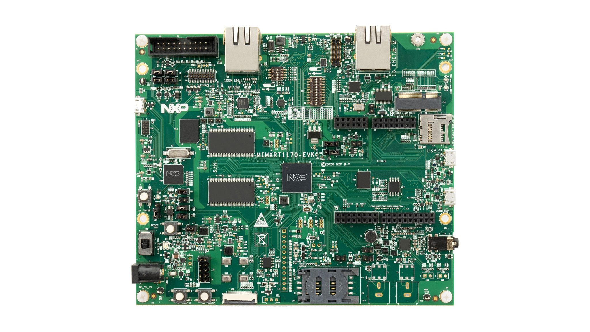

# CHIP RT1170 All-cluster Application

The all-cluster example implements a server wich can be accesed by a CHIP controller and acts 
on software level as a zigbee coordinator and accepts basic ZCL comands on a number of clusters.

The example is based on
[Project CHIP](https://github.com/project-chip/connectedhomeip) and the NXP RT1170 SDK,
and provides a prototype application that demonstrates device commissioning and different cluster
control.


<hr>

-   [CHIP RT1170 All-cluster Application](#chip-RT1170-all-cluster-application) 
-   [Introduction](#introduction)
-   [Application UI](#application-ui)
-   [Building](#building)
-   [Manufacturing data](#manufacturing)
-   [Flashing and debugging](#flashdebug)
-   [Testing the example](#testing-the-example)
-   [Matter Shell](#matter-shell)

<hr>

<a name="intro"></a>

## Introduction



The RT1170 all-cluster application provides a working demonstration of the
RT1170 board integration, built using the Project CHIP codebase and the NXP
RT1170 SDK. The example supports basic ZCL commands.

The example supports:

- Matter over openthread. For that follow instructions from [README_Openthread.md][README_Openthread.md].

[README_Openthread.md]: README_Openthread.md

- Matter over Wifi. For that follow instructions from [README_Wifi.md][README_Wifi.md].

[README_Wifi.md]: README_Wifi.md

The example targets the
[NXP MIMXRT1170-EVK](https://www.nxp.com/design/development-boards/i-mx-evaluation-and-development-boards/i-mx-rt1170-evaluation-kit:MIMXRT1170-EVK)
board by default.


<a name="building"></a>

## Building

In order to build the Project CHIP example, we recommend using a Linux
distribution (the demo-application was compiled on Ubuntu 20.04).

-   Download [IMXRT1170 SDK 2.13.0_firecrest_EAR4.6](https://mcuxpresso.nxp.com/).
  For internal SDK delivery, the SDK can be downloaded using the [KEX STAGE](https://kex-stage.nxp.com/en/welcome)
  Creating an nxp.com account is required before being able to download the
  SDK. Once the account is created, login and follow the steps for downloading
  SDK_2.13.0_EVK-MIMXRT1170. In the SDK Builder UI selection you should select
  the **FreeRTOS component**, the **BT/BLE component** and the **ARM GCC Toolchain**.
  SDK could also be retrieved with cloning [Internal SDK repository](https://bitbucket.sw.nxp.com/projects/MCUCORE/repos/mcu-sdk-2.0/browse ) 
  and setting branch develop/2.13.0_firecrest .

-   Start building the application

```
user@ubuntu:~/Desktop/git/connectedhomeip$ export NXP_SDK_ROOT=/home/user/Desktop/SDK_2_13_0_EVK-MIMXRT1170/ # or use the EVK-MIMXRT1170 SDK path when building for EVK-MIMXRT1170 board
user@ubuntu:~/Desktop/git/connectedhomeip$ source ./scripts/activate.sh
user@ubuntu:~/Desktop/git/connectedhomeip$ cd examples/all-cluster/nxp/rt/rt1170/
```

Optional GN options that can be added when building an application:

- To enable the [matter CLI](README.md#matter-shell), the argument ```chip_enable_matter_cli=true``` must be added to the *gn gen* command.
- To switch the SDK type used, the argument ```is_<sdk_type>=true``` must be added to the *gn gen* command (with <sdk_type> being either sdk_package or sdk_internal).
- To build the application in debug mode, the argument ```is_debug=true optimize_debug=false``` must be added to the *gn gen* command.
- To build with the option to have Matter certificates/keys pre-loaded in a specific flash area the argument ```chip_with_factory_data=1``` must be added to the *gn gen* command. (for more information see [Guide for writing manufacturing data on NXP devices](../../../../platform/nxp/doc/manufacturing_flow.md).

Refer to the Building section in wi-fi or openthread specific README file.

<a name="hardware"></a>

## Hardware requirements

Host part:
- 1 EVK-MIMXRT1170

Transceiver part :
- 1 WIFI IWX12 BOARD RD USD

## Hardware rework for SPI support on EVK-MIMXRT1170

To support SPI on the EVK-MIMXRT1170 board, it is required to remove 0Ω resistors R404,R406,R408.

## Board settings

### RT1170 + IWX12 (Spinel over SPI, BLE over UART)

The below table explains pin settings (SPI settings) to connect the evkmimxrt1170 (host) to a IWX12 transceiver (rcp).
Note, for the RESET, IWX12-J10-pin37 is the full reset of the board, to reset only the rcp, use J10-pin16.

| PIN NAME OF IWX12 |    IWX12    | I.MXRT1170  | PIN NAME OF RT1170 | GPIO NAME OF RT1170 |
| :---------------: | :---------: | :---------: | :----------------: | :-----------------: |
|     SPI_MOSI      | J10, pin 19 | J10, pin 8  |    LPSPI1_SOUT     |     GPIO_AD_30      |
|     SPI_MISO      | J10, pin 21 | J10, pin 10 |     LPSPI1_SIN     |     GPIO_AD_31      |
|     SPI_FRM       | J10, pin 24 | J10, pin 6  |    LPSPI1_PCS0     |     GPIO_AD_29      |
|     SPI_CLK       | J10, pin 23 | J10, pin 12 |     LPSPI1_SCK     |     GPIO_AD_28      |
|        GND        | J10, pin 9  | J10, pin 14 |         XX         |         XX          |
|       RESET       | J10, pin 37 | J26, pin 2  |     GPIO_AD_10     |     GPIO_AD_10      |
|      SPI_INT      | J10, pin 15 | J26, pin 4  |     GPIO_AD_11     |     GPIO_AD_11      |

The below table explains pin settings (UART settings) to connect the evkmimxrt1170 (host) to a IWX12 transceiver (bluetooth).

| PIN NAME OF IWX12 |    IWX12    | I.MXRT1170  | PIN NAME OF RT1170 | GPIO NAME OF RT1170 |
| :---------------: | :---------: | :---------: | :----------------: | :-----------------: |
|     UART_SIN      | J10, pin 8  | J25, pin 15 |    GPIO_AD_00      |     GPIO_AD_00      |
|     UART_SOUT     | J10, pin 10 | J25, pin 13 |    GPIO_AD_01      |     GPIO_AD_01      |
|     UART_CTS      | J10, pin 7  | J25, pin 9  |    GPIO_AD_02      |     GPIO_AD_02      |
|     UART_RTS      | J10, pin 11 | J25, pin 11 |    GPIO_AD_03      |     GPIO_AD_03      |

Hardware rework for RT1170 board:

- Populate a 0 ohm resistor in R97, it’s an 0201 size resistor footprint.

The jumper settings for IWX12 board:

- Connect JP19
- Disconnect JP16

Power for IWX12 board:

- Use external 5V power supply

For IWX12 running on QFN_IPA board an external antenna should be plugged on ANT3 J4.
The IWX12 board should be plugged to the RT1170 via SDIO.

<a name="manufacturing"></a>

## Manufacturing data

See [Guide for writing manufacturing data on NXP devices](../../../platform/nxp/doc/manufacturing_flow.md)

Other comments:

TODO add information

<a name="flashdebug"></a>

## Flashing and debugging

In order to flash the application we recommend using
[MCUXpresso IDE (version >= 11.5.0)](https://www.nxp.com/design/software/development-software/mcuxpresso-software-and-tools-/mcuxpresso-integrated-development-environment-ide:MCUXpresso-IDE).

-   Import the previously downloaded NXP SDK into MCUXpresso IDE. This can be
    done by drag-and-dropping the SDK archive into MCUXpresso IDE's "Installed
    SDKs" tab; 
-   Import the connectedhomeip repo in MCUXpresso IDE as Makefile Project. Use _none_ as _Toolchain for Indexer Settings_:

```
File -> Import -> C/C++ -> Existing Code as Makefile Project
```

- Configure MCU Settings:

```
Right click on the Project -> Properties -> C/C++ Build -> MCU Settings -> Select MIMXRT1170 -> Apply & Close
```


Sometimes when the MCU is selected it will not initialize all the memory regions (usualy the BOARD_FLASH, BOARD_SDRAM 
and NCAHCE_REGION) so it is required that this regions are added manualy like in the image above. In addition to that 
on the BOARD_FLASH line, in the driver tab: 
```
click inside the tab and on the right side a button with three horizontal dots will appear 
click on the button and an window will show
form the dropdown menu select the MIMXRT1170_SFDP_QSPI driver
```


- Configure the toolchain editor:

```
Right click on the Project -> C/C++ Build-> Tool Chain Editor -> NXP MCU Tools -> Apply & Close
```


- Create a debug configuration:

```
Right click on the Project -> Debug -> As->SEGGER J-Link probes -> OK -> Select elf file
```


- Set the _Initialization Commands_ to:

```
Right click on the Project -> Debug As -> Debug configurations... -> Startup

set non-stop on
set pagination off
set mi-async
set remotetimeout 60000
##target_extended_remote##
set mem inaccessible-by-default ${mem.access}
mon ondisconnect ${ondisconnect}
set arm force-mode thumb
${load}
```


- Set the _vector.catch_ value to _false_ inside the .launch file:

```
Right click on the Project -> Utilities -> Open Directory Browser here -> edit *.launch file:

<booleanAttribute key="vector.catch" value="false"/>

```

- Debug using the newly created configuration file:

## Testing the example

To know how to commision a device over BLE, follow the instructions from [chip-tool's README.md 'Commission a device over BLE'][readme_ble_commissioning_section].

[readme_ble_commissioning_section]:../../../../chip-tool/README.md#commission-a-device-over-ble

To know how to commissioning a device over IP, follow the instructions from [chip-tool's README.md 'Pair a device over IP'][readme_pair_ip_commissioning_section]

[readme_pair_ip_commissioning_section]: ../../../../chip-tool/README.md#pair-a-device-over-ip

### Testing the all-clusters application without Matter CLI:

1. Prepare the board with the flashed `All-cluster application` (as shown above).
2. The All-cluster example uses UART1 to print logs while runing the server. To view raw UART output, start a terminal emulator like PuTTY and connect to the used COM port with the following UART settings:

   - Baud rate: 115200
   - 8 data bits
   - 1 stop bit
   - No parity
   - No flow control

3. Open a terminal connection on the board and watch the printed logs.

4. On the client side, start sending commands using the [chip-tool](../../../../../examples/chip-tool)  application as it is described [here](../../../../../examples/chip-tool/README.md#using-the-client-to-send-matter-commands).

### Testing the all-clusters application with Matter CLI enabled:

The Matter CLI can be enabled with the all-clusters application.

For more information about the Matter CLI default commands, you can refer to the dedicated [ReadMe](../../../../shell/README.md).

The All-clusters application supports additional commands :
```
> help
[...]
mattercommissioning     Open/close the commissioning window. Usage : mattercommissioning [on|off]
matterfactoryreset      Perform a factory reset on the device
matterreset             Reset the device
```
- ```matterfactoryreset``` command erases the file system completely (all Matter settings are erased).
- ```matterreset``` enables the device to reboot without erasing the settings.

Here are described steps to use the all-cluster-app with the Matter CLI enabled

1. Prepare the board with the flashed `All-cluster application` (as shown above).
2. The matter CLI is accessible in UART1. For that, start a terminal emulator like PuTTY and connect to the used COM port with the following UART settings:

   - Baud rate: 115200
   - 8 data bits
   - 1 stop bit
   - No parity
   - No flow control

3. The All-cluster example uses UART2 to print logs while runing the server. To view raw UART output, a pin should be plugged to an USB to UART adapter (connector J9 pin 4), then start a terminal emulator like PuTTY and connect to the used COM port with the following UART settings:

   - Baud rate: 115200
   - 8 data bits
   - 1 stop bit
   - No parity
   - No flow control

4. On the client side, start sending commands using the [chip-tool](../../../../../examples/chip-tool)  application as it is described [here](../../../../../examples/chip-tool/README.md#using-the-client-to-send-matter-commands).