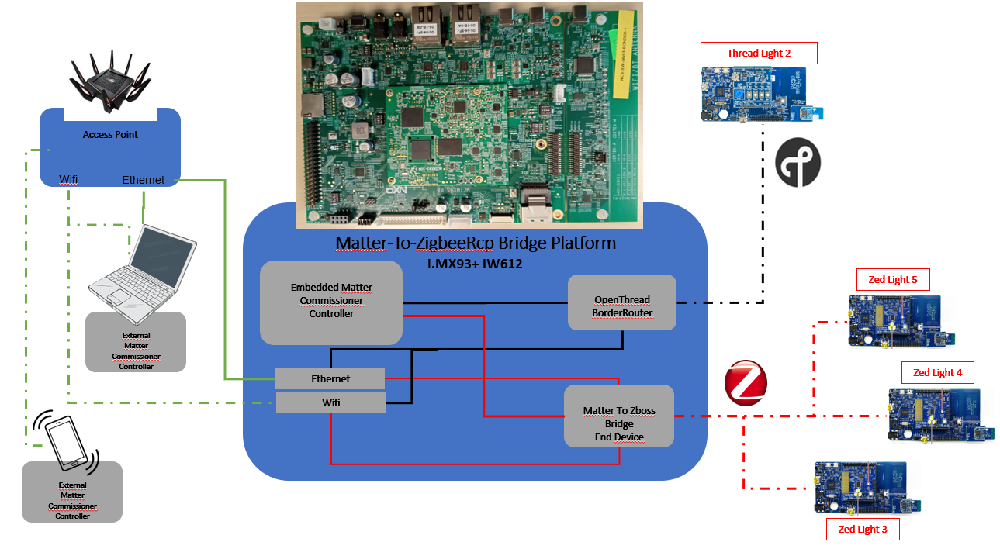

# Linux NXP Matter To ZigbeeRcp Bridge Example

An example demonstrating a simple lighting bridge and the use of dynamic
endpoints. The document will describe the theory of operation and how to build
and run NXP Matter To ZigbeeRcp Bridge Example on i.MX93 + IW612 M2 Murata module.

<hr>

-   [NXP Matter To ZigbeeRcp Bridge Example](#nxp-matter-to-zigbeercp-bridge-example)
    -   [Theory of Operation](#theory-of-operation)
    -   [Setup](#imx93--iw612-setup)
    -   [Running the Complete Example on i.MX93 + IW612 M2 Murata](#running-the-complete-example-on-imx93--iw612-m2-murata)

<hr>

## Theory of Operation

The Linux NXP Matter To ZigbeeRcp Bridge Example (hereafter M2ZigbeeRcp-bridge) is derived from the official "connectedhomeip" Linux Bridge example

As soon as a Zigbee device joins its Zigbee network, a new runtime Matter Dynamic Endpoint is created

Depending on Endpoints and Clusters supported by these new Bridged device, Matter commands can be used to control it


### Software architecture

Matter To ZigbeeRcp Bridge Example architecture is as described in following diagram:


### NXP Matter To ZigbeeRcp Bridge ZAP file

In M2ZigbeeRcp-bridge-zap folder, the M2ZigbeeRcp-bridge-app.zap defines 3 endpoints:
-   Endpoint0 is Matter Root Node
-   Endpoint1 is the Matter Aggregator endpoint with Identify, Descriptor, Binding and Actions clusters
-   Endpoint2 is a dummy endpoint which contains _all_ the clusters that may be used in Dynamic Endpoints 

This dummy Endpoint2 will be disabled  at runtime but its main goal is to be used at coding time  
It allows to have usable coding data structures .e.g GENERATED_CLUSTERS, GENERATED_ATTRIBUTES, GENERATED_COMMANDS, GENERATED_EVENTS and so on  
More details regarding these data structures can be found in out/aarch64/gen/third_party/connectedhomeip/examples/bridge-app/nxp/linux-M2ZigbeeRcp-bridge/M2ZigbeeRcp-bridge-zap/zapgen/zap-generated/endpoint_config.h

Note that any Attribute from any Cluster must have its "Storage Option" set to "External" in M2ZigbeeRcp-bridge-app.zap  
Therefore it will rely on the application to maintain storage for any attribute  
Consequently, reads or writes to any attribute must be handled within the application by the `emberAfExternalAttributeReadCallback` and `emberAfExternalAttributeWriteCallback` functions

### Zigbee network
In the current implementation, M2ZigbeeRcp-bridge as a Zigbee Coordinator  
It means that it creates its own Zigbee network to which Zigbee devices can join  
For network creation, permit to Zigbee devices to join, M2ZigbeeRcp-bridge provides its Actions clusters:  

|Action ID|Description|
|:-------|:-------|
|0x1001|Initialize Zigbee stack|
|0x1002|Allow Zigbee devices to join the Zigbee network|
|0x1003|Prevent Zigbee devices to join the Zigbee network|


### Zigbee device commissioning and discovery
When Action 0x1001 and 0x1002 are performed, Zigbee device (ZED) that performs a Beacon Request will join the network  
Once ZED commissionning to the network is done, M2ZigbeeRcp-bridge will:
-   request for its active endpoints
-   request the Simple Descriptor of each Active endpoint to get its clusters
-   request Discover Attributes for each cluster
-   request to read all Clusters attributes in case ZED answered to Discover Attributes requests

At the end of the sequence, M2ZigbeeRcp-bridge saved all datas into a dedicated data structure for this ZED: `g_devices_ctx.devices[index]` (Max index is MATTER_ZIGBEERCP_BRIDGE_DEV_NUMBER = 255)  
ZED can be announced to the Bridge Manager and declared to the Matter Fabric as new Dynamic endpoint 

### Dynamic Endpoints

M2ZigbeeRcp-bridge is designed to bridge any Zigbee device whatever its Endpoints or Clusters by Endpoint numbers  
This design thus implies that predefined macros as `DECLARE_DYNAMIC_ENDPOINT`, `DECLARE_DYNAMIC_CLUSTER`, `DECLARE_DYNAMIC_ATTRIBUTE` and their companion macros can't be used

M2ZigbeeRcp-bridge creates a new `Device` object with this `g_devices_ctx.devices[index]`

Let's take the non-existing example of a Zigbee device which only contains Endpoint#1 with only the On/Off cluster
M2ZigbeeRcp-bridge will need to add a Dynamic Endpoint with the 3 clusters of `Device` object:
-   Descriptor
-   Bridged Device Basic Information
-   On/Off

On/Off cluster structure defined in GENERATED_CLUSTERS macro from endpoint_config.h is:

    { \
    /* Endpoint: 2, Cluster: On/Off (server) */ \
    .clusterId = 0x00000006, \
    .attributes = ZAP_ATTRIBUTE_INDEX(220), \
    .attributeCount = 7, \
    .clusterSize = 0, \
    .mask = ZAP_CLUSTER_MASK(SERVER) | ZAP_CLUSTER_MASK(INIT_FUNCTION) | ZAP_CLUSTER_MASK(SHUTDOWN_FUNCTION), \
    .functions = chipFuncArrayOnOffServer, \
    .acceptedCommandList = ZAP_GENERATED_COMMANDS_INDEX( 76 ), \
    .generatedCommandList = nullptr, \
    .eventList = nullptr, \
    .eventCount = 0, \
    },\

This On/Off cluster:
-   works as a Server with 2 Matter callbacks emberAfOnOffClusterServerInitCallback and MatterOnOffClusterServerShutdownCallback from chipFuncArrayOnOffServer defined in GENERATED_FUNCTION_ARRAYS
-   has 7 attributes and its first one starts at index#220 of GENERATED_ATTRIBUTES
-   has 6 accepted commands and its first one starts at index#76 of GENERATED_COMMANDS
-   no event

M2ZigbeeRcp-bridge will just add this On/Off cluster structure to the `Device->clusterList`

Finally, M2ZigbeeRcp-bridge adds the new Endpoint (in `AddDeviceEndpoint`) using the `emberAfSetDynamicEndpoint`Matter API  
ZED devices are now referenced with a Endpoint (starting at `3`) number of the M2ZigbeeRcp-bridge Matter NodeId

### Dynamic Endpoint control

Using chip-tool, it is possible to read and write ZED attributes directly with `emberAfExternalAttributeReadCallback` and `emberAfExternalAttributeWriteCallback`

Handling Matter commands is slightly different  
In Matter source code, commands are implemented in `src/app/CommandHandlerImpl.cpp` with `mpCallback->DispatchCommand(*this, concretePath, commandDataReader)` call  
M2ZigbeeRcp-bridge needs to intercept command to execute them on Zigbee bridged devices

Interception can be done thanks to 2 Matter callbacks defined in `src/app/util/MatterCallbacks.h`:
-   BridgeCallbacks::PreCommandReceived  
-   BridgeCallbacks::PostCommandReceived  

But their primary implementation doesn't fit with M2ZigbeeRcp-bridge needs  
To execute a command, M2ZigbeeRcp-bridge needs to retrieve to which Dynamic Endpoint and Cluster it is intended to  

`commandDataReader` structure contains the datas needed to identify Dynamic Endpoint and Cluster  
But it can't be used directly in `PreCommandReceived`, reading it also consumes it, leaving `DispatchCommand` with an empty command request

Solution was to patch Matter source code and overwrite the 2 callback functions in `BridgeMngr.cpp`

-   src/app/util/MatterCallbacks.h -> additionnal include and change the prototypes to add aCommandElement parameter

    ```sh
        #include <app/MessageDef/InvokeRequestMessage.h>
        #include <app/MessageDef/InvokeResponseMessage.h>
        virtual CHIP_ERROR PreCommandReceived(const chip::app::ConcreteCommandPath & commandPath,
                                        const chip::Access::SubjectDescriptor & subjectDescriptor, chip::app::CommandDataIB::Parser & aCommandElement)
        virtual void PostCommandReceived(const chip::app::ConcreteCommandPath & commandPath,
                                        const chip::Access::SubjectDescriptor & subjectDescriptor, chip::app::CommandDataIB::Parser & aCommandElement)
            
    ```

-   src/app/CommandHandlerImpl.cpp -> call the callbacks with new prototypes

    ```sh
        In ProcessCommandDataIB API:
            SuccessOrExit(err = DataModelCallbacks::GetInstance()->PreCommandReceived(concretePath, GetSubjectDescriptor(), aCommandElement));
            mpCallback->DispatchCommand(*this, concretePath, commandDataReader);
            DataModelCallbacks::GetInstance()->PostCommandReceived(concretePath, GetSubjectDescriptor(), aCommandElement);

        In ProcessGroupCommandDataIB API:
            if ((err = DataModelCallbacks::GetInstance()->PreCommandReceived(concretePath, GetSubjectDescriptor(), aCommandElement)) == CHIP_NO_ERROR)
            {
                TLV::TLVReader dataReader(commandDataReader);
                mpCallback->DispatchCommand(*this, concretePath, dataReader);
                DataModelCallbacks::GetInstance()->PostCommandReceived(concretePath, GetSubjectDescriptor(), aCommandElement);
            }

    ```

-   src/app/util/BUILD.gn -> additionnal include

    ```sh
        deps = [
            "${chip_root}/src/access",
            "${chip_root}/src/app/MessageDef",
            "${chip_root}/src/app:paths",
        ]

    ```

Last but not least, `PreCommandReceived` implementation MAY needs to be "Cluster aware" to correctly translate the Matter command structure into Zigbee command structure used by `HandleSendCommand`  
Currently, app::Clusters::LevelControl::Commands::MoveToLevel and app::Clusters::Groups::Commands::AddGroup are handled  
A workarround for app::Clusters::OnOff command is also implemented   
Extra implementation for any other cluster should be coded here  

## i.MX93 + IW612 Setup



- i.MX93 + IW612 M2 Murata
From IOTZTB-DK006 Packages:
- 3 x Light/Sensor node (K32W061-XK01)
- 1 Generic switch node (K32W061-XK02)
- x86 with Ubuntu 24.04 Laptop

### i.MX93 + IW612 M2 Murata building and flashing

-   To build the Linux meta-nxp-connectivity BSP image to flash on i.MX93 (full details in https://github.com/nxp-imx/meta-nxp-connectivity/blob/master/README.md#How-to-build-the-Yocto-image)

    ```sh
    $ mkdir ~/bin
    $ curl http://commondatastorage.googleapis.com/git-repo-downloads/repo > ~/bin/repo
    $ chmod a+x ~/bin/repo
    $ export PATH=${PATH}:~/bin

    $ mkdir ${MY_YOCTO} # this directory will be the top directory of the Yocto source code
    $ cd ${MY_YOCTO}
    $ repo init -u https://github.com/nxp-imx/imx-manifest -b imx-linux-scarthgap -m imx-6.6.36-2.1.0.xml
    $ repo sync
    $ cd ${MY_YOCTO}/sources/meta-nxp-connectivity
    $ git remote update
    $ git checkout imx_matter_2024_q3
    $ MACHINE=imx93evk-iwxxx-matter DISTRO=fsl-imx-xwayland source sources/meta-nxp-connectivity/tools/imx-matter-setup.sh bld-xwayland-imx93
    $ bitbake imx-image-multimedia

    ```
    After execution of previous commands, the Yocto image will be generated:
    - ${MY_YOCTO}/bld-xwayland-imx93/tmp/deploy/images/imx93evk-iwxxx-matter/imx-image-multimedia-imx93evk-iwxxx-matter.wic.zst

-   Flash i.MX93 with [Universal Update Utility](https://github.com/nxp-imx/mfgtools)

    ```sh
    uuu.exe -b emmc_all imx-image-multimedia-imx93evk-iwxxx-matter.wic.zst

    ```

### i.MX93 + IW612 M2 Murata preparation for Dual Pan 

-   Create an IW612 dedicated wifi_mod_para_IW612.conf for moal.ko load

    ```sh
    cd /lib/firmware/nxp/
    cat << EOF > wifi_mod_para_IW612.conf
    SDIW612 = {
            cfg80211_wext=0xf
            max_vir_bss=1
            cal_data_cfg=none
            ps_mode=1
            auto_ds=1
            host_mlme=1
            fw_name=nxp/sd_w61x_v1.bin_to_load
    #        fw_name=nxp/sduart_nw61x_v1.bin_to_load
    }
    EOF
    ls -l

    ```
 
-   Save native IW612 embedded Secured Firmware binaries

    ```sh
    cd /lib/firmware/nxp/
    mv sd_w61x_v1.bin.se sd_w61x_v1.bin.se_bsp_native
    mv sduart_nw61x_v1.bin.se sduart_nw61x_v1.bin.se_bsp_native
    mv uartspi_n61x_v1.bin.se uartspi_n61x_v1.bin.se_bsp_native
    mv uartuart_n61x_v1.bin.se uartuart_n61x_v1.bin.se_bsp_native

    ```

-   Create symbolic links for Secured IW612 Firmware binaries

    ```sh
    ln -s sd_w61x_v1.bin.se_bsp_native sd_w61x_v1.bin_to_load
    ln -s sduart_nw61x_v1.bin.se_bsp_native sduart_nw61x_v1.bin_to_load
    ln -s uartspi_n61x_v1.bin.se_bsp_native uartspi_n61x_v1.bin.se
    ln -s uartuart_n61x_v1.bin.se_bsp_native uartuart_n61x_v1.bin.se

    ```

-   Save native ot-daemon and otbr-agent files embedded in BSP (UART versions for k32w)

    ```sh
    mv /usr/bin/ot-daemon /usr/bin/ot-daemon-k32w
    mv /usr/bin/ot-client-ctl /usr/bin/ot-client-ctl-k32w
    mv /usr/sbin/otbr-agent /usr/sbin/otbr-agent-k32w
    mv /usr/sbin/ot-ctl /usr/sbin/ot-ctl-k32w
    mv /etc/default/otbr-agent /etc/default/otbr-agent-k32w

    ```

-   Create symbolic links for functional ot-daemon and otbr-agent -> UART

    ```sh
    ln -sf /usr/bin/ot-client-iwxxx-uart /usr/bin/ot-client
    ln -sf /usr/bin/ot-daemon-iwxxx-uart /usr/bin/ot-daemon
    ln -sf /usr/sbin/ot-ctl-iwxxx-uart /usr/sbin/ot-ctl
    ln -sf /usr/sbin/otbr-agent-iwxxx-uart /usr/sbin/otbr-agent
    ln -sf /etc/default/otbr-agent-iwxxx-uart /etc/default/otbr-agent

    ```

-   In "/etc/default/otbr-agent-iwxxx-uart" file, UART OTBR_AGENT_OPTS are "eth0" backbone interface by default, edit the file to use "mlan0" interface

    ```sh
    root@imx93evk-iwxxx-matter:~# cat /etc/default/otbr-agent-iwxxx-uart
    # Default settings for otbr-agent. This file is sourced by systemd

    # Options to pass to otbr-agent
    #OTBR_AGENT_OPTS="-I wpan0 -B eth0 spinel+hdlc+uart:///dev/ttyACM0 trel://eth0"
    OTBR_AGENT_OPTS="-d 1 -I wpan0 -B mlan0 'spinel+hdlc+uart:///tmp/ttyOpenThread' trel://mlan0"

    OTBR_NO_AUTO_ATTACH=0
    root@imx93evk-iwxxx-matter:~#
    
    ```

-   Create wpa_supplicant.conf

    ```sh
    cd /root
    cat << EOF > wpa_supplicant.conf
    ctrl_interface=/var/run/wpa_supplicant
    ctrl_interface_group=0
    network={
        ssid="ACCESS_POINT_SSID"
        psk="ACCESS_POINT_PASSWORD"
    }
    EOF
    
    ```

-   Set i.MX93 as a Wifi Station

    ```sh
    cp /lib/systemd/network/80-wifi-station.network.example /lib/systemd/network/80-wifi-station.network

    ```


-   In /etc/default/zb_mux.env, you can change log and trace levels for zb_mux application

    ```sh
    Resultant files are located in /var/local/zboss: zb_mux.log and zb_mux.console
    ```

-   In /etc/default/zb_app.env:

    ```sh
    Comment default ZB_APP_NAME line and add a new line
    ZB_APP_NAME = M2ZigbeeRcp-bridge
    - Choose 15.4 channel for Zigbee with MACSPLIT_CHANNEL

    - Choose IEEE address for M2ZigbeeRcp-bridge with MACSPLIT_IEEE_ADDR

    - Adjust log and trace levels for M2ZigbeeRcp-bridge
        Resultant files will be located in /var/local/zboss: matter-zigbeercp-bridge.log and matter-zigbeercp-bridge.console
    ```

### Generic switch node (K32W061-XK02) building and flashing
-   build the chip-k32w0x-light-switch-combo-example.bin

    ```sh
    git clone https://github.com/NXP/matter.git matter_nxp_v1.4.0
    cd matter_nxp_v1.4.0/
    scripts/checkout_submodules.py --shallow --platform nxp --recursive
    source scripts/bootstrap.sh --platform nxp
    source scripts/activate.sh 
    third_party/nxp/nxp_matter_support/scripts/update_nxp_sdk.py --platform k32w0
    cd examples/light-switch-combo-app/nxp/k32w0
    ```

    Optionnaly, modify the following files has below:
    - .gn, add following lines after line 27 (import("//args.gni")):

    ```sh
    pw_build_PIP_CONSTRAINTS = [ "${chip_root}/scripts/setup/constraints.txt" ]
    pw_build_PIP_REQUIREMENTS =
       [ "${chip_root}/scripts/setup/requirements.build.txt" ]
    ```

    - args.gni:
    ```sh
    chip_stack_lock_tracking = "none"

    ```

    - BUILD.gn:

    1 add following line after line 29 (chip_software_version = 0):

    ```sh
    chip_simple_hash_verification = 0
    ```

    2 add following lines after line 161 (outputs = [ "${root_build_dir}/${output_name}" ]):

    ```sh
    if (chip_simple_hash_verification == 1) {
    args = [ "--simple-hash" ]
    }
    ```

    Finally, build the application

    ```sh
    gn gen out/debug
    ninja -C out/debug
    ```

-   flash resulting chip-k32w0x-light-switch-combo-example.bin on Generic switch node (K32W061-XK02)

    ```sh
    DK6Programmer.exe -V2 -s COMXX -P 1000000 -Y -p FLASH@0x0000="chip-k32w0x-light-switch-combo-example.bin"
    ```
### Light/Sensor node (K32W061-XK01) flashing
-   get the DimmableLight_GpProxy_OM15081.bin from [Zibgee JN-AN-1244.zip](https://www.nxp.com/webapp/sps/download/license.jsp?colCode=JN-AN-1244)
-   flash DimmableLight_GpProxy_OM15081.bin on each Light/Sensor node (K32W061-XK01)

    ```sh
    DK6Programmer.exe -V2 -s COMxx -P 1000000 -Y -p FLASH@0x0000="DimmableLight_GpProxy_OM15081.bin"
    ```
### x86 Ubuntu 24.04 laptop
-   To use this laptop as External Matter Commissioner/Controller, execute following sequence to build chip-tool

    ```sh
    cd /home
    git clone https://github.com/project-chip/connectedhomeip.git
    cd /home/connectedhomeip
    git pull
    git submodule update --init
    sudo apt-get install git gcc g++ pkg-config libssl-dev libdbus-1-dev libglib2.0-dev libavahi-client-dev ninja-build python3-venv python3-dev python3-pip unzip libgirepository1.0-dev libcairo2-dev libreadline-dev default-jre
    source scripts/activate.sh
    source scripts/bootstrap.sh
    ./scripts/examples/gn_build_example.sh examples/chip-tool out
    cd out

    ./chip-tool
    # this last command shows the chip-tool clusters available commands as below
    [1730971898.904] [2073165:2073165] [TOO] Missing cluster or command set name
    Usage:
    ./chip-tool cluster_name command_name [param1 param2 ...]
    or:
    ./chip-tool command_set_name command_name [param1 param2 ...]
    
    +-------------------------------------------------------------------------------------+
    | Clusters:                                                                           |
    +-------------------------------------------------------------------------------------+
    | * accesscontrol                                                                     |
    | * accountlogin                                                                      |
    | * actions                                                                           |
    ...
    ```


## Running the Complete Example on i.MX93 + IW612 M2 Murata

### M2ZigbeeRcp-bridge runtime initialization
Once i.MX93 + IW M2 Murata is booted, execute following prerequisites commands in the terminal

-   Load IW612 Wifi Firmware and Connect Wifi to AccessPoint

    ```sh
    mlan_moal_folder=$(uname -r)
    cd /lib/modules/${mlan_moal_folder}/updates
    insmod mlan.ko
    insmod moal.ko mod_para=/lib/firmware/nxp/wifi_mod_para_IW612.conf
    cd /root
    ifconfig mlan0 up
    killall wpa_supplicant
    wpa_supplicant -d -B -i mlan0 -c ./wpa_supplicant.conf

    echo 1 > /proc/sys/net/ipv6/conf/all/forwarding
    echo 1 > /proc/sys/net/ipv4/ip_forward
    echo 2 > /proc/sys/net/ipv6/conf/all/accept_ra

    ```

-   Load IW612 BT/15.4 Firmware and start Zigbee and otbr-agent services

    ```sh
    echo 7 > /proc/sys/kernel/printk
    systemctl start zb_config.service
    systemctl start zb_mux.service
    systemctl start otbr-agent.service
    systemctl start zb_app.service
    tail -f /var/local/zboss/matter-zigbeercp-bridge.console &

    ```

-   Configure IP tables for otbr-agent routing

    ```sh
    iptables -v -A FORWARD -i mlan0 -o wpan0 -j ACCEPT
    sleep 0.5
    iptables -v -A FORWARD -i wpan0 -o mlan0 -j ACCEPT
    sleep 0.5
    ip6tables -v -A FORWARD -i mlan0 -o wpan0 -j ACCEPT
    sleep 0.5
    ip6tables -v -A FORWARD -i wpan0 -o mlan0 -j ACCEPT
    sleep 0.5

    ```

-   Create the Thread network on with same MACSPLIT_CHANNEL defined in /etc/default/zb_app.env

    ```sh
    channel=${MACSPLIT_CHANNEL}
    extpanid=BEEF00BEEF081172
    networkkey=00112233445566778899aabbcc721108
    networkname=Matter-NXP-JYS
    panid=0x1234
    sleep 1
    ot-ctl factoryreset
    sleep 2
    ot-ctl dataset init new
    ot-ctl dataset channel ${channel};ot-ctl dataset panid ${panid};ot-ctl dataset extpanid ${extpanid};ot-ctl dataset networkname ${networkname};ot-ctl dataset networkkey ${networkkey}
    ot-ctl dataset commit active
    ot-ctl ifconfig up
    sleep 2
    ot-ctl thread start
    sleep 5
    ifconfig wpan0
    ot-ctl state

    ```

### M2ZigbeeRcp-bridge operating

> **Important: For this section and the following one**  
> M2ZigbeeRcp-bridge can be Matter controlled either internally to i.MX93 or externally by x86 Ubuntu 22.04 laptop  
>  
> For external mode, x86 Ubuntu 22.04 laptop must be connected to the same Wifi Access Point as i.MX93 used in /root/wpa_supplicant.conf  
>       ssid="ACCESS_POINT_SSID"  
>       psk="ACCESS_POINT_PASSWORD"  
>  
> Go to location where you built chip-tool  
> cd /home/connectedhomeip  
> Just replace "chip-tool" by "./chip-tool" for subsequent commands  


-   M2ZigbeeRcp-bridge Embedded "onnetwork" commissioning with Matter NodeID=1

    ```sh
    chip-tool pairing onnetwork 1 20202021

    ```
-   Create the Zigbee network

    M2ZigbeeRcp-bridge Endpoint#1 Actions cluster currently handles 3 actions

    |Action ID|Description|
    |:-------|:-------|
    |0x1001|Initialize Zigbee stack|
    |0x1002|Allow Zigbee devices to join the Zigbee network|
    |0x1003|Prevent Zigbee devices to join the Zigbee network|

    ```sh
    chip-tool actions instant-action 0x1001 1 1
    chip-tool actions instant-action 0x1002 1 1

    ```
    M2ZigbeeRcp-bridge is now ready to:

    - let a Zigbee End Device to join its Zigbee network
    - discover active endpoints, clusters and attributes of this Zigbee End Device
    - dynamically declare this Zigbee End Device as a new Bridged Matter device

- "Zed Light 3" as a Zigbee Bridged Matter device

    - power on "Zed Light 3" from a Factory Reset state
    - Once "Zed Light 3" is declared as Bridged to M2ZigbeeRcp-bridge, it is reachable through Endpoint#3 of NodeId#1

        ```sh
        chip-tool onoff read on-off 1 3
        chip-tool onoff toggle 1 3
        chip-tool levelcontrol move-to-level 20 0 0 0 1 3
        chip-tool levelcontrol read current-level 1 3
        
        ```

- "Zed Light 4" as a Zigbee Bridged Matter device

    - power on "Zed Light 4" from a Factory Reset state
    - Once "Zed Light 4" is declared as Bridged to M2ZigbeeRcp-bridge, it is reachable through Endpoint#4 of NodeId#1

        ```sh
        chip-tool onoff read on-off 1 4
        chip-tool onoff toggle 1 4
        chip-tool levelcontrol move-to-level 20 0 0 0 1 4
        chip-tool levelcontrol read current-level 1 4
        
        ```

- "Zed Light 5" as a Zigbee Bridged Matter device

    - power on "Zed Light 5" from a Factory Reset state
    - Once "Zed Light 5" is declared as Bridged to M2ZigbeeRcp-bridge, it is reachable through Endpoint#5 of NodeId#1

        ```sh
        chip-tool onoff read on-off 1 5
        chip-tool onoff toggle 1 5
        chip-tool levelcontrol move-to-level 20 0 0 0 1 5
        chip-tool levelcontrol read current-level 1 5
        
        ```

- "Thread Light 2" as a Thread Matter device

    - power on "Thread Light 2" from a Factory Reset state and start Bluetooth Adverstising

    - get Thread network credentials
        ```sh
        THREAD_DATASET=$(ot-ctl dataset active -x | grep -v "Done" | tr '\r' ' ')
        
        ```

    - "Thread Light 2" Embedded "ble-thread" Commissioning with Matter NodeID=2
        ```sh
        chip-tool pairing ble-thread 2 hex:${THREAD_DATASET} 20202021 3840

        ```
    - "Thread Light 2" is reachable through Endpoint#1 of NodeId#2

        ```sh
        chip-tool onoff read on-off 2 1
        chip-tool onoff toggle 2 1
        
        ```

### Matter On/Off Group testing

- Configuring the Server side for Group Commands

    - Create a Matter group on M2ZigbeeRcp-bridge node

        ```sh
        chip-tool groupkeymanagement key-set-write '{"groupKeySetID": 72, "groupKeySecurityPolicy": 0, "epochKey0": "d0d1d2d3d4d5d6d7d8d9dadbdcdddedf", "epochStartTime0": 2220000,"epochKey1": "d1d1d2d3d4d5d6d7d8d9dadbdcdddedf", "epochStartTime1": 2220001,"epochKey2": "d2d1d2d3d4d5d6d7d8d9dadbdcdddedf", "epochStartTime2": 2220002 }' 1 0
        chip-tool groupkeymanagement write group-key-map '[{"groupId": 10240, "groupKeySetID": 72}]' 1 0
        
        ```

    - Give access control of M2ZigbeeRcp-bridge On/Off cluster to the group

        ```sh
        chip-tool accesscontrol write acl '[{"fabricIndex": 0, "privilege": 5, "authMode": 2, "subjects": [112233], "targets": null}, {"fabricIndex": 0, "privilege": 3, "authMode": 3, "subjects": [10240], "targets": [{"cluster": 6, "endpoint": null, "deviceType": null}]}]' 1 0
        
        ```

    - Create a Matter group on "Thread Light 2" node

        ```sh
        chip-tool groupkeymanagement key-set-write '{"groupKeySetID": 72, "groupKeySecurityPolicy": 0, "epochKey0": "d0d1d2d3d4d5d6d7d8d9dadbdcdddedf", "epochStartTime0": 2220000,"epochKey1": "d1d1d2d3d4d5d6d7d8d9dadbdcdddedf", "epochStartTime1": 2220001,"epochKey2": "d2d1d2d3d4d5d6d7d8d9dadbdcdddedf", "epochStartTime2": 2220002 }' 2 0
        chip-tool groupkeymanagement write group-key-map '[{"groupId": 10240, "groupKeySetID": 72}]' 2 0
        
        ```

    - Give access control of "Thread Light 2" On/Off cluster to the group

        ```sh
        chip-tool accesscontrol write acl '[{"fabricIndex": 0, "privilege": 5, "authMode": 2, "subjects": [112233], "targets": null}, {"fabricIndex": 0, "privilege": 3, "authMode": 3, "subjects": [10240], "targets": [{"cluster": 6, "endpoint": 1, "deviceType": null}]}]' 2 0
        
        ```

- Configuring the Client side for Group Commands

    - Create "M2Z-BR-Light" group on M2ZigbeeRcp-bridge node

        ```sh
        chip-tool groupsettings add-group M2Z-BR-Light 10240
        chip-tool groupsettings add-keysets 72 0 2220000 hex:d0d1d2d3d4d5d6d7d8d9dadbdcdddedf
        chip-tool groupsettings bind-keyset 10240 72
        
        ```

- Add "M2Z-BR-Light" group to "Zed Light 3", "Zed Light 4" , "Zed Light 5" and "Thread Light 2"

    ```sh
    chip-tool groups add-group 10240 M2Z-BR-Light 1 3
    chip-tool groups add-group 10240 M2Z-BR-Light 1 4
    chip-tool groups add-group 10240 M2Z-BR-Light 1 5
    chip-tool groups add-group 10240 M2Z-BR-Light 2 1
    
    ```

- Toggle "Zed Light 3", "Zed Light 4", "Zed Light 5" and "Thread Light 2" state

    ```sh
    chip-tool onoff toggle 0xFFFFFFFFFFFF2800 1
    
    ```


