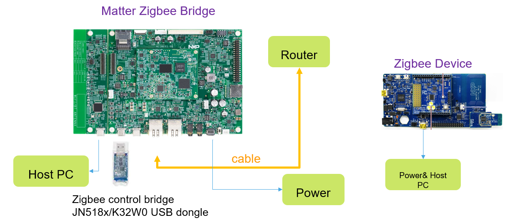

# NXP Linux Matter-Zigbee Bridge Example Application

The example demonstrating a simple Matter-Zigbee bridge and the use of dynamic endpoints. Zigbee devices can
join the Matter network through the Matter-Zigbee Bridge. The Bridge can through Ethernet or wifi to join in
Matter Network.

Support Zigbee devices type:
- Lighting
- Temperature Sensor

The document will describe the theory of operation and how to build
and run CHIP Linux Matter-Zigbee Bridge Example on NXP i.MX93, NXP k32W061 as Zigbee DCP connect to i.MX93.

About how to use the wifi or join in Homekit ecosystem can refer to the doc.
[NXP linux Matter-Zigbee Bridge User Guide](https://community.nxp.com/t5/i-MX-Processors-Knowledge-Base/Matter-Zigbee-Bridge-base-on-i-MX-MPU-and-K32W/ta-p/1675962)



### Dynamic Endpoints

The Bridge Example makes use of Dynamic Endpoints. Current SDK support is
limited for dynamic endpoints, since endpoints are typically defined (along with
the clusters and attributes they contain) in a .zap file which then generates
code and static structures to define the endpoints.

To support endpoints that are not statically defined, the ZCL attribute storage
mechanisms will hold additional endpoint information for `NUM_DYNAMIC_ENDPOINTS`
additional endpoints. These additional endpoint structures must be defined by
the application and can change at runtime.

To facilitate the creation of these endpoint structures, several macros are
defined:

`DECLARE_DYNAMIC_ATTRIBUTE_LIST_BEGIN(attrListName)`
`DECLARE_DYNAMIC_ATTRIBUTE(attId, attType, attSizeBytes, attrMask)`
`DECLARE_DYNAMIC_ATTRIBUTE_LIST_END(clusterRevision)`

-   These three macros are used to declare a list of attributes for use within a
    cluster. The declaration must begin with the
    `DECLARE_DYNAMIC_ATTRIBUTE_LIST_BEGIN` macro which will define the name of
    the allocated attribute structure. Each attribute is then added by the
    `DECLARE_DYNAMIC_ATTRIBUTE` macro. Finally,
    `DECLARE_DYNAMIC_ATTRIBUTE_LIST_END` macro should be used to close the
    definition.

-   All attributes defined with these macros will be configured as
    `ATTRIBUTE_MASK_EXTERNAL_STORAGE` in the ZCL database and therefore will
    rely on the application to maintain storage for the attribute. Consequently,
    reads or writes to these attributes must be handled within the application
    by the `emberAfExternalAttributeWriteCallback` and
    `emberAfExternalAttributeReadCallback` functions. See the bridge
    application's `main.cpp` for an example of this implementation.

`DECLARE_DYNAMIC_CLUSTER_LIST_BEGIN(clusterListName)`
`DECLARE_DYNAMIC_CLUSTER(clusterId, clusterAttrs, incomingCommands, outgoingCommands)`
`DECLARE_DYNAMIC_CLUSTER_LIST_END`

-   These three macros are used to declare a list of clusters for use within a
    endpoint. The declaration must begin with the
    `DECLARE_DYNAMIC_CLUSTER_LIST_BEGIN` macro which will define the name of the
    allocated cluster structure. Each cluster is then added by the
    `DECLARE_DYNAMIC_CLUSTER` macro referencing attribute list previously
    defined by the `DECLARE_DYNAMIC_ATTRIBUTE...` macros and the lists of
    incoming/outgoing commands terminated by kInvalidCommandId (or nullptr if
    there aren't any commands in the list). Finally,
    `DECLARE_DYNAMIC_CLUSTER_LIST_END` macro should be used to close the
    definition.

`DECLARE_DYNAMIC_ENDPOINT(endpointName, clusterList)`

-   This macro is used to declare an endpoint and its associated cluster list,
    which must be previously defined by the `DECLARE_DYNAMIC_CLUSTER...` macros.

<a name="building"></a>

## Building

-   Prepare Build Enviroment on Host PC

    - Install Yocto SDK. Refer to the ReadME to generate SDK.[How to build OpenThread Border Router with the Yocto SDK](https://github.com/nxp-imx/meta-matter/blob/imx_matter_2023_q2/README.md)

        ```
        # Generate yocto sdk
        $ bitbake imx-image-multimedia -c populate_sdk

        # install sdk for i.MX93
        $ sudo tmp/deploy/sdk/fsl-imx-xwayland-glibc-x86_64-imx-image-multimedia-armv8a-imx93evk-toolchain-6.1-langdale.sh
        ```

    -   Build the example application:

        ```
        user@ubuntu:~/Desktop/git/connectedhomeip$ export export IMX_SDK_ROOT=/opt/fsl-imx-xwayland/6.1-langdale-imx93
        user@ubuntu:~/Desktop/git/connectedhomeip$ source scripts/activate.sh
        user@ubuntu:~/Desktop/git/connectedhomeip$ ./scripts/examples/imxlinux_example.sh -s examples/bridge-app/nxp/linux-imx -o out/imx-bridge-app debug -d
        ```
Then the imx-chip-bridge-app was generated under out/imx-bridge-app

## Running the Complete Example on i.MX93

-   Prerequisites
    1. An i.MX93 EVK board
    2. A USB K32W061 Dongle, a K32W061 DK6 EVK, a OM15081-2 board
    3. An OTBR

-   Deploy sotfware
    1. copy imx-chip-bridge-app to i.MX93 board

    2. Flash Image into K32W
        - Install DK6Programmer.exe on windows PC
            - Download [K32W061DK6 SDK 2.6.12](https://cache.nxp.com/lgfiles/bsps/SDK_2_6_12_K32W061DK6.zip). DK6Programmer.exe Installer Path: SDK_2_6_12_K32W061DK6\tools\ JN-SW-4407 DK6 Production Flash Programmer v4564.exe

        - Download [Zigbee control bridge Binary](https://drive.google.com/file/d/1VWGZ0LDO5L5Tt3in31ykTqjugB9PZye7/view?usp=drive_link) to K32W USB dongle
            ```
            DK6Programmer.exe -s <COM_PORT> -e FLASH -p ControlBridge_Full_GpProxy_1000000.bin
            ```
        - Download Zigbee Light Binary to K32W DK6.  [JN-AN-1244](https://www.nxp.com/webapp/sps/download/license.jsp?colCode=JN-AN-1244)\Binaries\DimmableLight_GpProxy_OM15081\DimmableLight_GpProxy_OM15081.bin
            ```
            DK6Programmer.exe -s <COM_PORT> -e FLASH -p DimmableLight_GpProxy_OM15081.bin
            ```
        - Download Zigbee Temperature Sensor Binary K32W DK6.  [JN-AN-1246](https://www.nxp.com/webapp/sps/download/license.jsp?colCode=JN-AN-1246)\Binaries\LTOSensor_NtagIcode_Ota_OM15081R2\ LTOSensor_NtagIcode_Ota_OM15081R2_V1.bin
            ```
            DK6Programmer.exe -s <COM_PORT> -e FLASH -p LTOSensor_NtagIcode_Ota_OM15081R2_V1.bin
            ```
    3. Setup OTBR, Connect K32W USB dongle to i.MX93 and connect the i.MX93 EVK to Router.

-   Running

    - Run Linux Bridge Example App

        ```
        $ cd ~
        $ ./imx-chip-bridge-app


        #enter 1 in i.MX93 console to take bridge into allow zigbee device join state
        #enter 2 in i.MX93 console to check joined Zigbee devices
        ```

    -  Matter-Zigbee Bridge join in Matter network

        Run these commands on OTBR side.
        ```
        # 1. Onnetwork pairing
        $ chip-tool pairing onnetwork 8888 20202021

        # 2. Matter actions
        # Action1: Start Network
        # Action2: permit join
        # Action3: Factory reset
        # Factory reset: $ chip-tool actions instant-action  0x1003  8888 1
        # Start Network: $ chip-tool actions instant-action  0x1001  8888 1
        # permit join:   $ chip-tool actions instant-action  0x1002  8888 1

        # Allow Zigbee Device join
        $ chip-tool actions instant-action  0x1002  8888 1

        # 3. Check joined Zigbee devices name
        $ chip-tool bridgeddevicebasicinformation read node-label 8888 3

        # 4. Cluster Control
        # onoff
        $ chip-tool onoff toggle 8888 3

        # Temperature
        $ chip-tool temperaturemeasurement read measured-value 8888 4

        # Subscribe Temperature data
        $ chip-tool interactive start
        > temperaturemeasurement subscribe measured-value 10 20 8888 4
        ```